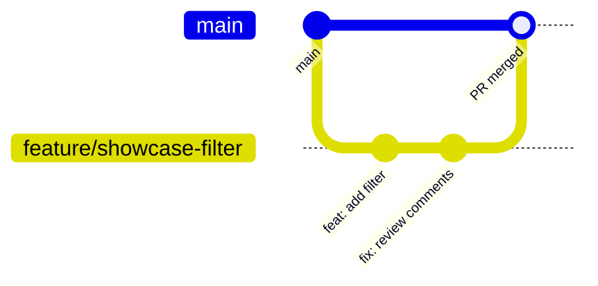

# 01 · Local setup: from a fresh laptop to a running app

This guide takes you from a brand-new machine to the app running at <http://localhost:3000>. After that, it covers the Git workflow we use every day.

> **Time needed:** about 60–90 minutes the first time, mostly downloads.
> **Conventions:**
> - `PS>` blocks are for **Windows PowerShell**. Bash blocks are for **macOS/Linux** Terminal.
> - A block without a label works everywhere.
> - Don't type the `PS>` itself.

---

## Contents
1. [Install the tools](#1-install-the-tools)
2. [Configure Git and sign in to GitHub](#2-configure-git-and-sign-in-to-github)
3. [Clone the repo and install dependencies](#3-clone-the-repo-and-install-dependencies)
4. [Create your `.env` file](#4-create-your-env-file)
5. [Start the database, migrate and seed](#5-start-the-database-migrate-and-seed)
6. [Start the app and check it works](#6-start-the-app-and-check-it-works)
7. [Everyday Git workflow](#7-everyday-git-workflow)
8. [Lint, type-check, build and tests](#8-lint-type-check-build-and-tests)
9. [Troubleshooting](#9-troubleshooting)

---

## 1. Install the tools

| Tool | Version we use | Why | Official download |
|---|---|---|---|
| Git | 2.55 or newer | Version control | <https://git-scm.com/downloads> |
| Node.js | **24.19.0** (LTS) | Runs Next.js, Prisma, npm | via a version manager (below) |
| npm | comes with Node (11.x) | Our package manager (`package-lock.json`) | included with Node |
| Docker Desktop | 29.x (Compose v2+) | Runs PostgreSQL locally | <https://www.docker.com/products/docker-desktop/> |
| VS Code | latest | Our agreed editor | <https://code.visualstudio.com/> |
| GitHub CLI (`gh`) | latest | Log in to GitHub, open PRs | <https://cli.github.com/> |
| WSL 2 (Windows only) | latest | Docker Desktop needs it | installed with `wsl --install` |

> **Use npm only.** Please don't use `yarn`, `pnpm` or `bun`, even though the boilerplate `my-capstone/README.md` mentions them. Mixing package managers creates extra lockfiles and "works on my machine" bugs.

### 1.1 Git

**Windows**
1. Download and run the installer from <https://git-scm.com/downloads/win>. The defaults are fine; when asked for a default editor, choose **Visual Studio Code**.
2. Or use winget:
   ```powershell
   PS> winget install --id Git.Git -e
   ```

**macOS**
```bash
xcode-select --install     # installs Apple's Git + build tools
# or, if you use Homebrew (https://brew.sh):
brew install git
```

**Linux (Ubuntu/Debian)**
```bash
sudo apt update && sudo apt install -y git
```

Check it (close and reopen the terminal first):
```
git --version
```

### 1.2 Node.js 24.19.0 via a version manager

We use a **version manager** rather than the plain Node installer. It lets you install the exact version the project needs and switch versions later without uninstalling anything.

**Windows: nvm-windows**
1. If you already installed Node from nodejs.org, uninstall it first (Settings → Apps).
2. Download `nvm-setup.exe` from <https://github.com/coreybutler/nvm-windows/releases> (latest release) and run it.
3. Open a **new** PowerShell window **as Administrator**:
   ```powershell
   PS> nvm install 24.19.0
   PS> nvm use 24.19.0
   ```

**macOS / Linux: nvm**
1. Install nvm. Copy the current install command from <https://github.com/nvm-sh/nvm#installing-and-updating>; it looks like this:
   ```bash
   curl -o- https://raw.githubusercontent.com/nvm-sh/nvm/v0.40.3/install.sh | bash
   ```
2. Close and reopen the terminal, then:
   ```bash
   nvm install 24.19.0
   nvm alias default 24.19.0
   ```

Check it:
```
node -v     # v24.19.0
npm -v      # 11.x
```

### 1.3 Docker Desktop

We only use Docker **locally** to run PostgreSQL. You don't need to install Postgres itself.

**Windows**
1. Turn on WSL 2. In PowerShell **as Administrator**, run this and then restart when asked:
   ```powershell
   PS> wsl --install
   ```
2. Install Docker Desktop from <https://www.docker.com/products/docker-desktop/>. Keep **"Use WSL 2 instead of Hyper-V"** ticked.
3. Start Docker Desktop and wait until the whale icon says **Engine running**.

**macOS**
1. Download the right build for your chip (Apple menu → About This Mac → **Apple M…** = Apple silicon, **Intel** = Intel) from <https://www.docker.com/products/docker-desktop/>.
2. Drag it to Applications, open it, and accept the prompts.

**Linux**: install Docker Engine plus the Compose plugin with the official guide: <https://docs.docker.com/engine/install/ubuntu/>. Then let your user run Docker without `sudo`:
```bash
sudo usermod -aG docker $USER   # then log out and back in
```

Check it:
```
docker --version
docker compose version
```

### 1.4 VS Code and extensions

Install VS Code from <https://code.visualstudio.com/>.
- **Windows:** tick **"Add to PATH"** during install.
- **macOS:** open VS Code, press `Cmd+Shift+P`, and run **"Shell Command: Install 'code' command in PATH"**.

Then install the recommended extensions:
```
code --install-extension Prisma.prisma
code --install-extension dbaeumer.vscode-eslint
code --install-extension bradlc.vscode-tailwindcss
code --install-extension ms-azuretools.vscode-docker
code --install-extension eamodio.gitlens
```

| Extension | Why |
|---|---|
| Prisma | Syntax highlighting, formatting and autocomplete for `schema.prisma` |
| ESLint | Shows lint errors as you type |
| Tailwind CSS IntelliSense | Autocompletes `className="…"` utility classes |
| Docker | See and restart containers from the sidebar |
| GitLens (optional) | See who changed a line and why |

### 1.5 GitHub CLI

```powershell
PS> winget install --id GitHub.cli -e
```
```bash
brew install gh                       # macOS
sudo apt install gh                   # Ubuntu 24.04+ (or see https://github.com/cli/cli/blob/trunk/docs/install_linux.md)
```

> **"Command not found" right after installing something?** Close **every** terminal and VS Code window, then reopen them. That's the most common setup problem on our team.

---

## 2. Configure Git and sign in to GitHub

### 2.1 Tell Git who you are
Use the **same email as your GitHub account** so your commits are linked to you.
```
git config --global user.name "Your Name"
git config --global user.email "you@example.com"
git config --global init.defaultBranch main
git config --global pull.rebase false
```

Windows only: keep line endings consistent with the rest of the team.
```powershell
PS> git config --global core.autocrlf true
```

macOS/Linux:
```bash
git config --global core.autocrlf input
```

### 2.2 Authenticate with GitHub

There are two common ways to do this:

| | **GitHub CLI (recommended)** | SSH key |
|---|---|---|
| How | `gh auth login` stores a token and sets Git up to use it | You create a key pair and upload the public key to GitHub |
| Clone URL | `https://github.com/...` | `git@github.com:...` |
| Why pick it | One command. It also lets you create PRs from the terminal (`gh pr create`) | Works without any extra tool. Some people prefer it |

**Recommended: GitHub CLI**
```
gh auth login
```
Answer the prompts:
1. **GitHub.com**
2. **HTTPS**
3. **Yes** (authenticate Git with your GitHub credentials)
4. **Login with a web browser**

Copy the one-time code, paste it into the browser page, then check:
```
gh auth status
```

**Alternative: SSH key**
```
ssh-keygen -t ed25519 -C "you@example.com"
```
Press Enter to accept the default file location, and set a passphrase. Then add the **public** key (the file ending in `.pub`, never the other one) to GitHub. `gh` can upload it for you:
```
gh ssh-key add ~/.ssh/id_ed25519.pub --title "My laptop"
```
Or copy it manually and paste it at GitHub → Settings → SSH and GPG keys → New SSH key:
```powershell
PS> Get-Content $env:USERPROFILE\.ssh\id_ed25519.pub | Set-Clipboard
```
```bash
pbcopy < ~/.ssh/id_ed25519.pub     # macOS
cat ~/.ssh/id_ed25519.pub          # Linux: copy the output
```
Test it:
```
ssh -T git@github.com
```

---

## 3. Clone the repo and install dependencies

1. Pick a folder for your code, for example `Documents\code` or `~/code`, and clone into it:
   ```
   git clone https://github.com/sc-u3226864/9785_Group53B.git
   ```
   (SSH users: `git clone git@github.com:sc-u3226864/9785_Group53B.git`)

2. Move into the **app folder**. Every command from here on runs inside `my-capstone/`:
   ```
   cd 9785_Group53B/my-capstone
   ```

3. Open it in VS Code:
   ```
   code .
   ```
   In VS Code, open a terminal with ``Ctrl+` `` (Windows) or ``Cmd+` `` (macOS). It opens in `my-capstone/`.

4. Install dependencies:
   ```
   npm ci
   ```
   - `npm ci` installs the **exact** versions in `package-lock.json`. Use it for a fresh install or after pulling changes.
   - Use `npm install <package>` only when you're deliberately **adding** a package.
   - At the end, you should see `✔ Generated Prisma Client (7.10.0) to .\src\generated\prisma`. The `postinstall` script in `package.json` runs `prisma generate` for you.
   - You may see a warning about `allowScripts` and `esbuild`. That's expected and harmless.

---

## 4. Create your `.env` file

The app reads its settings and secrets from `my-capstone/.env`.
- This file is **ignored by Git** (see `.gitignore`), so it never gets committed.
- We commit a template, `.env.example`, which holds placeholders only.

1. Copy the template (from inside `my-capstone/`):
   ```powershell
   PS> Copy-Item .env.example .env
   ```
   ```bash
   cp .env.example .env
   ```
2. Open `.env` in VS Code and fill in each value, using the table and steps below.

| Variable | What it's for | What to put locally |
|---|---|---|
| `POSTGRES_USER` | Username created inside the Postgres container (read by `docker-compose.yml`) | Any name, e.g. `capstone` |
| `POSTGRES_PASSWORD` | That user's password | Any password you like, letters and numbers only |
| `POSTGRES_DB` | Database name | Leave as `appdb` |
| `DATABASE_URL` | How Prisma and the app connect to Postgres | `postgresql://<POSTGRES_USER>:<POSTGRES_PASSWORD>@localhost:5432/appdb?schema=public`, using **your** values from the three lines above |
| `AUTH_SECRET` | Auth.js uses it to sign/encrypt cookies | A random string; see [4.1](#41-generate-auth_secret) |
| `AUTH_GOOGLE_ID` | Your Google OAuth client ID | See [4.2](#42-create-your-own-google-oauth-client) |
| `AUTH_GOOGLE_SECRET` | Your Google OAuth client secret | See [4.2](#42-create-your-own-google-oauth-client) |
| `SEED_CONVENER_EMAILS` | Google email(s) that `npm run db:seed` makes **conveners** (admins) | Your own Gmail/Google address. Separate several with commas |

Lines under "Production server only" in `.env.example` stay **commented out** on your laptop.

> ⚠️ **Never** paste real secrets into chat, screenshots, commits, issues or these docs. If a secret leaks, rotate it (see [03 → Rotating secrets](03-authentication.md#rotating-secrets)).

### 4.1 Generate `AUTH_SECRET`

Run this, then paste the output after `AUTH_SECRET=`:
```
node -e "console.log(require('crypto').randomBytes(32).toString('base64'))"
```

> `.env.example` also suggests `npx auth secret`. That works, but it may write the value into a **`.env.local`** file instead of `.env`. Either file works for Next.js; just don't leave two different values lying around.

### 4.2 Create your own Google OAuth client

Each of us uses our **own** Google Cloud project for local development, so nobody has to share secrets.

1. Go to <https://console.cloud.google.com/> and sign in with your Google account.
2. Create a new project: use the project picker at the top → **New project** → name it e.g. `capstone-dev-yourname` → **Create**. Make sure it's selected.
3. Open **APIs & Services → OAuth consent screen**. On newer consoles this is called **Google Auth Platform**.
   1. Click **Get started**.
   2. App name: `Capstone dev`. Support email: yours.
   3. Audience: **External**.
   4. Contact email: yours. Agree, then click **Create**.
4. Under **Audience**, check that the publishing status is **Testing**. Then add your own Google address, and any accounts you'll test with, under **Test users**.
   Only test users can sign in while the app is in Testing mode.
5. Go to **Clients** (or **Credentials → Create credentials → OAuth client ID**):
   1. Application type: **Web application**. Name: `localhost`.
   2. **Authorised JavaScript origins:** `http://localhost:3000`
   3. **Authorised redirect URIs:** `http://localhost:3000/api/auth/callback/google`
   4. Click **Create**.
6. Copy the **Client ID** into `AUTH_GOOGLE_ID` and the **Client secret** into `AUTH_GOOGLE_SECRET`.

The redirect URI must match **exactly**: `http` rather than `https`, port `3000`, and no trailing slash. It comes from our auth route at `src/app/api/auth/[...nextauth]/route.ts`.

---

## 5. Start the database, migrate and seed

Make sure Docker Desktop is running, then from `my-capstone/`:

1. **Start Postgres.** This runs `docker compose up -d` using `my-capstone/docker-compose.yml`:
   ```
   npm run db:up
   ```
   Check it's running. You should see `postgres` with `127.0.0.1:5432->5432/tcp`:
   ```
   docker compose ps
   ```
   The port is bound to `127.0.0.1`, so only your own machine can reach the database. Your data lives in a Docker **volume** called `pgdata`, so it survives restarts.

2. **Create the tables** by applying every migration in `prisma/migrations/`:
   ```
   npm run db:migrate
   ```
   This runs `prisma migrate dev`. On a fresh DB it prints `Applying migration 20260929064528_init` and then `Your database is now in sync with your schema.`
   If it asks for a migration name, **stop** (press `Ctrl+C`). That means your `schema.prisma` differs from `main`; see [02](02-database-and-prisma.md).

3. **Add starter data.** This runs `prisma/seed.ts`:
   ```
   npm run db:seed
   ```
   Expected output: `Seeded 1 convener(s), 2 projects, 1 post.`
   The seed:
   - pre-creates your `SEED_CONVENER_EMAILS` account(s) as **CONVENER**
   - adds two published sample projects
   - adds one showcase post

   It's safe to run more than once.

---

## 6. Start the app and check it works

```
npm run dev
```

Wait for `✓ Ready`, then open **<http://localhost:3000>**.

Checklist:
1. **Home** (`/`) shows the heading **"Industry projects, built by students"** and the buttons **Become a mentor** and **Become a sponsor**.
2. **Showcase** (`/showcase`) lists **"Welcome to the showcase"**. That proves the database connection works.
3. Click **Sign in** in the top-right and choose the Google account you put in `SEED_CONVENER_EMAILS`. You're returned to the home page. The navbar now shows your name with a **convener** badge and a **Dashboard** link.
4. **Dashboard** (`/dashboard`) shows "Convener dashboard".
5. Click **Sign out**.

To test other roles, sign in with a **second** Google account (add it as a test user in step 4.2). It starts with **no role**. See [03-authentication.md](03-authentication.md#the-role-lifecycle) for how it gets one.

Stop the dev server with `Ctrl+C`. At the end of the day you can stop the database too; your data is kept:
```
npm run db:down
```

**Next time**, you only need:
```
npm run db:up
npm run dev
```

---

## 7. Everyday Git workflow

We use **feature branches and pull requests (PRs) into `main`**. Nobody pushes directly to `main`, and every PR needs **one approval** from a teammate before it's merged.



### 7.1 Start of every task: get the latest `main`
```
git checkout main
git pull origin main
npm ci                    # if package-lock.json changed
npm run db:migrate        # if new migrations arrived
```

### 7.2 Create a branch
Name it `<type>/<short-description>`, lowercase with hyphens:
```
git checkout -b feature/project-tech-stack
```
Types we use: `feature/`, `fix/`, `docs/`, `chore/`, `refactor/`.

### 7.3 Make changes, then check what changed
```
git status
git diff
```
- `git status` lists modified and new files.
- `git diff` shows the exact lines changed.

### 7.4 Stage and commit
Stage specific files. This is better than `git add .`, because you won't accidentally commit junk:
```
git add prisma/schema.prisma prisma/migrations src/actions/projects.ts
git status
```

Commit using the **Conventional Commits** style we already use (`feat:`, `fix:`, `docs:`, `refactor:`, `chore:`):
```
git commit -m "feat: add techStack field to projects"
```

Good messages:
- say **what and why**
- use the present tense
- keep the subject line under about 70 characters

For example: `fix: stop students submitting two EOIs for one project`. Avoid: `changes`, `stuff`, `final version 2`.

Commit small and often. One task can have many commits.

### 7.5 Push and open a pull request
The first time you push a branch:
```
git push -u origin feature/project-tech-stack
```
After that, `git push` is enough.

Open the PR:
```
gh pr create --base main --fill --web
```
Or go to the repo on GitHub and click the yellow **Compare & pull request** banner.

In the PR description, say:
- what changed
- how you tested it
- any schema/migration or `.env` changes, so reviewers know to run `npm run db:migrate` or update their `.env`

Also request a reviewer.

**Reviewing a teammate's PR:**
1. Check out their branch:
   ```
   gh pr checkout <number>
   ```
2. Run the app, then leave comments on GitHub or approve.
3. The author (or reviewer) clicks **Squash and merge** after approval.
4. The author deletes the branch.

### 7.6 Keep your branch up to date with `main`
If `main` has moved on while you work:
```
git checkout main
git pull origin main
git checkout feature/project-tech-stack
git merge main
```
We use **merge**, not rebase, because it's easier to recover from while learning. Push again afterwards.

### 7.7 Resolve a simple merge conflict
If `git merge main` says `CONFLICT (content): Merge conflict in src/components/nav/navbar.tsx`:

1. Open the file in VS Code. You'll see markers like these:
   ```
   <<<<<<< HEAD
   { href: "/showcase", label: "Showcase" },
   =======
   { href: "/showcase", label: "Project showcase" },
   >>>>>>> main
   ```
   - `HEAD` is your version.
   - The part below `=======` is the version from `main`.
2. Use VS Code's buttons (**Accept Current / Accept Incoming / Accept Both**), or edit by hand. Remove all the `<<<<<<<`, `=======` and `>>>>>>>` lines.
3. Save, then mark the conflict resolved and finish the merge:
   ```
   git add src/components/nav/navbar.tsx
   git commit
   ```
4. Run the app to check it still works, then `git push`.

**Conflicts in `package-lock.json`:** accept the incoming (`main`) version, then run `npm install` to re-add your packages. Commit the result.
**Conflicts in `prisma/migrations/`:** see [02 → Two people changed the schema](02-database-and-prisma.md#when-two-people-change-the-schema-at-the-same-time).

**Stuck?** Run `git merge --abort` to go back to how things were before the merge, then ask the team.

### 7.8 Undo cheat-sheet
| I want to… | Command |
|---|---|
| Throw away my changes to one file | `git restore path/to/file` |
| Unstage a file (keep the changes) | `git restore --staged path/to/file` |
| Fix the message of my last (unpushed) commit | `git commit --amend -m "new message"` |
| Park my work to switch branch | `git stash push -m "wip"` then later `git stash pop` |

### 7.9 One-time repo settings (repo owner: Sophia)

These enforce "PRs only, one approval, everyone notified". The repo is public, so rulesets are available on the free plan.

1. GitHub repo → **Settings → Rules → Rulesets → New ruleset → New branch ruleset**.
2. Name: `protect-main`. Enforcement status: **Active**.
3. Under **Target branches**, choose **Add target → Include default branch**.
4. Tick:
   - **Restrict deletions**
   - **Block force pushes**
   - **Require a pull request before merging**, with **Required approvals: 1**, and tick **Dismiss stale pull request approvals when new commits are pushed**
5. **Create**.
6. Settings → General → Pull Requests: tick **Allow squash merging** and **Automatically delete head branches**.

**Notifications (everyone):** on the repo page, click **Watch → Custom → Pull requests** (or **All activity**). Choose email or GitHub mobile notifications at <https://github.com/settings/notifications>.

*Optional:* to auto-request reviewers, add a `.github/CODEOWNERS` file (not created yet), e.g.:
```
* @sc-u3226864 @shlooop @Dani-hub433 @ahmedlaiba6
```

---

## 8. Lint, type-check, build and tests

All run from `my-capstone/`:

| Command | What it checks | Run it… |
|---|---|---|
| `npm run lint` | ESLint rules (`eslint.config.mjs`) | Before every PR |
| `npm run typecheck` | TypeScript errors across the whole project | Before every PR |
| `npm run build` | Full production build (includes the type check) | Before merging anything big |
| `npm run start` | Serves the result of `npm run build` at <http://localhost:3000> | To try the production build locally |

> ⚠️ Right now `lint`, `typecheck` and `build` **fail** because of the known `SetRoleForm` import bug (see [README → Known issues](README.md#known-issues-to-be-aware-of-as-of-this-writing)). Once that's fixed, all three should pass on `main`. Please keep it that way.

**Tests:** there are **no automated tests yet** (no test runner or `test` script in `package.json`). If we add some later (e.g. Vitest for `src/lib/` and Playwright for pages), document the command here.

---

## 9. Troubleshooting

| Symptom | Cause / fix |
|---|---|
| `node`, `git`, `docker` or `code` "is not recognized" / "command not found" | Close all terminals **and VS Code** and reopen them. On Windows, sign out and back in if that fails. |
| `nvm use` fails with "exit status 1" (Windows) | Run PowerShell **as Administrator**. Also uninstall any Node that was installed from nodejs.org. |
| `npm ci` fails with `EBADENGINE` or odd syntax errors | Wrong Node version. Run `node -v`; it should be `v24.19.0` (`nvm use 24.19.0`). |
| `npm ci` says it can only install with an existing `package-lock.json` | You're in the wrong folder. `cd my-capstone`. |
| `Copy-Item: Cannot find path '...\.env.example'` | Same: you're at the repo root. `cd my-capstone` first. |
| `error during connect` / `Cannot connect to the Docker daemon` | Docker Desktop isn't running. Start it and wait for "Engine running". |
| Docker Desktop says WSL 2 is not installed/updated | In an admin PowerShell: `wsl --install` or `wsl --update`, then restart. |
| `Bind for 127.0.0.1:5432 failed: port is already allocated` | Something else already uses port 5432, often a locally installed PostgreSQL or another project's container. Stop it (`docker ps`, then `docker stop <name>`; or stop the "postgresql" service in Windows Services), then retry `npm run db:up`. |
| `P1000: Authentication failed against database server` | `DATABASE_URL` doesn't match `POSTGRES_USER`/`POSTGRES_PASSWORD`. **Also:** Postgres only reads those variables the **first** time the volume is created. If you changed them later, either change them back, or wipe the local DB (loses local data) with `docker compose down -v` then `npm run db:up`. |
| `P1001: Can't reach database server at localhost:5432` | The DB isn't running: `npm run db:up`. |
| `Cannot find module '@/generated/prisma/client'` | The Prisma client wasn't generated. Run `npx prisma generate`. |
| `The migration ... was modified after it was applied` / "drift detected" / Prisma wants to reset | Your local DB is from before migrations were squashed. `npm run db:reset` (wipes **local** data), then `npm run db:seed`. |
| Google says `Error 400: redirect_uri_mismatch` | The redirect URI in Google Cloud must be exactly `http://localhost:3000/api/auth/callback/google`. |
| Google says `Access blocked: … has not completed the Google verification process` | Add that Google account as a **Test user** (step 4.2.4). |
| Page shows `[auth][error] MissingSecret` in the terminal | `AUTH_SECRET` is empty or still `changeme`. |
| `[auth][error] AdapterError` / `P2021 table does not exist` | You skipped migrations: `npm run db:migrate`. |
| Signed in, but no Dashboard link | Your Google email isn't in `SEED_CONVENER_EMAILS`, or you didn't re-run `npm run db:seed` after adding it. Fix it and re-run the seed, then sign out and in. |
| `ReferenceError: SetRoleForm is not defined` on `/dashboard` | Known bug (see README). It appears once a user with no role exists. |
| `Port 3000 is in use` | Another dev server is running. Close it, or accept Next's offer of port 3001. Note that Google sign-in only works on 3000. |
| `git push` rejected: `protected branch` / `non-fast-forward` on main | You're on `main`. Create a branch (`git checkout -b feature/x`), push that, and open a PR. |
| `git status` shows `migration_lock.toml` or other files changed that you didn't touch | Line endings. Set `core.autocrlf` as in 2.1, then `git restore <file>`. |
| VS Code shows red squiggles everywhere in `.ts` files after pulling | Run `npm ci` and `npx prisma generate`, then in VS Code run `Ctrl/Cmd+Shift+P` → **TypeScript: Restart TS Server**. |
