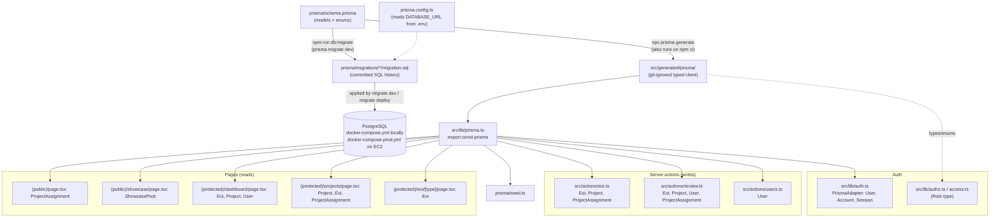
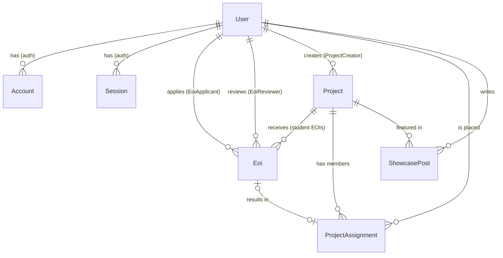

# 02 · Database and Prisma: changing the schema safely

This guide explains how the database is wired into the app, and how to change it without breaking anyone else's setup or the live server.

All commands run from `my-capstone/` with the local DB running (`npm run db:up`).

## Contents
1. [What Prisma is (plain English)](#1-what-prisma-is-plain-english)
2. [What connects to what](#2-what-connects-to-what)
3. [Our data model at a glance](#3-our-data-model-at-a-glance)
4. [Worked example A: add a field to `Project`](#4-worked-example-a-add-a-field-to-project)
5. [Worked example B: add a new model with a relation](#5-worked-example-b-add-a-new-model-with-a-relation)
6. [The Prisma commands and when to use each](#6-the-prisma-commands-and-when-to-use-each)
7. [Inspecting data with Prisma Studio](#7-inspecting-data-with-prisma-studio)
8. [Working on migrations as a team](#8-working-on-migrations-as-a-team)
9. [How migrations reach production](#9-how-migrations-reach-production)
10. [Troubleshooting](#troubleshooting)

---

## 1. What Prisma is (plain English)

**PostgreSQL** is the database: it stores tables of rows. **Prisma** is the translator between our TypeScript code and Postgres.

- **You describe the tables once**, in `prisma/schema.prisma`, as `model`s. For example, `model Project { title String … }`.
- **Prisma writes the SQL for you.** `prisma migrate dev` compares the schema to the database and writes a **migration**: a `.sql` file in `prisma/migrations/`. Migrations are committed to Git, so every laptop and the server build *exactly* the same tables, in the same order.
- **Prisma generates a typed client.** `prisma generate` reads the schema and creates TypeScript code in `src/generated/prisma/`. Then `prisma.project.findMany()` autocompletes, and TypeScript catches typos like `prisma.project.findMany({ where: { titel: … } })`.

Project-specific facts:

| Thing | Where / value |
|---|---|
| Prisma version | 7.10 (`prisma`, `@prisma/client`, `@prisma/adapter-pg` in `package.json`) |
| Prisma config | `prisma.config.ts`: sets the schema path, migrations folder, seed command, and reads `DATABASE_URL` from `.env` via `dotenv` |
| Schema | `prisma/schema.prisma` |
| Migrations | `prisma/migrations/<timestamp>_<name>/migration.sql` + `migration_lock.toml` |
| Generated client | `src/generated/prisma/`. **Git-ignored**, rebuilt by `npm ci` (`postinstall`) or `npx prisma generate` |
| Client instance | `src/lib/prisma.ts`: creates **one** `PrismaClient` using the `PrismaPg` driver adapter and reuses it across hot reloads |
| How code imports it | `import { prisma } from "@/lib/prisma";` (queries) and `import type { Role } from "@/generated/prisma/client";` (types/enums) |
| Seed script | `prisma/seed.ts`, run with `npm run db:seed` (`tsx prisma/seed.ts`) |
| Database | PostgreSQL 16 in Docker (`docker-compose.yml` locally, `docker-compose.prod.yml` on the server) |

> **Prisma 7 gotcha:** `prisma migrate dev` does **not** regenerate the client automatically (older Prisma versions did). After every schema change, run `npx prisma generate` yourself, or TypeScript won't know about your new field. We checked this on this repo.

---

## 2. What connects to what



### Which files use each model

Paths are relative to `my-capstone/src/`.

| Model | Read by | Written by |
|---|---|---|
| `User` | `lib/auth.ts` (adapter; puts `role` into the session), `app/(protected)/dashboard/page.tsx` | adapter on first sign-in, `actions/users.ts` (`setUserRole`), `actions/review.ts` (sets role on approval), `prisma/seed.ts` |
| `Account`, `Session`, `VerificationToken` | `lib/auth.ts` via `PrismaAdapter` only | Auth.js adapter only. **Don't write to these yourself** |
| `Project` | `app/(protected)/projects/page.tsx`, `app/(protected)/dashboard/page.tsx`, `actions/eoi.ts`, `actions/review.ts`, `app/(public)/page.tsx` (via assignment) | `prisma/seed.ts` (no UI yet; see [04](04-frontend-development.md)) |
| `Eoi` | `app/(protected)/dashboard/page.tsx`, `app/(protected)/projects/page.tsx`, `app/(protected)/eoi/[type]/page.tsx`, `actions/eoi.ts` | `actions/eoi.ts` (`submitStudentEoi`, `submitPartnerEoi`), `actions/review.ts` (`reviewEoi`) |
| `ProjectAssignment` | `app/(public)/page.tsx`, `app/(protected)/projects/page.tsx`, `actions/eoi.ts` | `actions/review.ts` |
| `ShowcasePost` | `app/(public)/showcase/page.tsx` | `prisma/seed.ts` |
| enum `Role` | `lib/access.ts`, `lib/authz.ts`, `components/nav/navbar.tsx`, `types/next-auth.d.ts`, `actions/users.ts` (zod enum) | — |
| enums `ParticipantType`, `EoiStatus`, `ProjectStatus` | the action/page files above (string literals like `"PENDING"`), `lib/validation/eoi.ts` | — |

**Rule of thumb:** before renaming or removing anything in `schema.prisma`, search the whole project for the name. In VS Code press `Ctrl/Cmd+Shift+F`, or run:
```
git grep -n "organisation"
```

---

## 3. Our data model at a glance



- `User.role` is **nullable**. `null` means "signed in, waiting for a convener".
- An `Eoi` has a `type` (STUDENT/MENTOR/SPONSOR) and a `status` (PENDING/APPROVED/REJECTED). Student EOIs point at a `projectId`; mentor/sponsor EOIs don't.
- `ProjectAssignment` is "user X is in project Y as type Z". It's unique per `(userId, projectId)`.
- The team's original design diagrams are in `Database_Information/` at the repo root. **`schema.prisma` is the source of truth** if they disagree.

---

## 4. Worked example A: add a field to `Project`

**Goal:** projects get an optional **tech stack** (e.g. "Next.js, Postgres") that students can see on `/projects`.

### Step 1: Branch
```
git checkout main
git pull origin main
git checkout -b feature/project-tech-stack
```

### Step 2: Edit the schema
In `prisma/schema.prisma`, add one line to `model Project`, under `capacity`:
```prisma
model Project {
  id          String        @id @default(cuid())
  title       String
  slug        String        @unique
  summary     String
  description String
  status      ProjectStatus @default(DRAFT)
  capacity    Int?          /// max students; null = unlimited
  techStack   String?       /// e.g. "Next.js, Postgres"   <-- NEW
  ...
}
```
The field is **optional** (`String?`). Existing rows have no value for it, and a *required* column would fail on a table that already has data unless you also give it a `@default(...)`.

### Step 3: Create and apply the migration
```
npm run db:migrate -- --name add_project_tech_stack
```
(Or just `npm run db:migrate` and type the name when asked.) Use a short `snake_case` name that says what changed.

Expected output:
```
Applying migration `20260930005151_add_project_tech_stack`
The following migration(s) have been created and applied from new schema changes:
prisma/migrations/
  └─ 20260930005151_add_project_tech_stack/
    └─ migration.sql
Your database is now in sync with your schema.
```
Open the new `migration.sql` and **read it**. It should be exactly:
```sql
-- AlterTable
ALTER TABLE "Project" ADD COLUMN     "techStack" TEXT;
```

### Step 4: Regenerate the client
```
npx prisma generate
```
Now `techStack` exists on the `Project` type.

### Step 5: Update every place that should know about it

| File | Change | Needed? |
|---|---|---|
| `src/app/(protected)/projects/page.tsx` | Add `techStack: true` to the `select` in `prisma.project.findMany`, and show it: `{p.techStack && <p className="mt-1 text-xs text-zinc-500">Stack: {p.techStack}</p>}` | Yes, that's the feature |
| `prisma/seed.ts` | Add `techStack: "Next.js, PostgreSQL"` to a sample project so fresh databases show it | Recommended |
| `src/lib/validation/…` | If a form lets people **enter** it, add e.g. `techStack: optionalText(200)` to that form's zod schema (see the `optionalText` helper in `src/lib/validation/eoi.ts`) | When a form exists ([04](04-frontend-development.md) builds one) |
| `src/actions/…` | Read it from `formData` and pass it into `prisma.project.create/update` | Same as above |
| Form component (`_components/*.tsx`) | Add the `<input name="techStack">` | Same as above |
| `src/app/(protected)/dashboard/page.tsx` | Nothing: it only selects `id` and `title` | No |
| Types | Nothing to hand-edit; the types come from `src/generated/prisma` | No |

Because every query uses `select`, a new field is **invisible until you select it**. That's intentional: it keeps pages from over-fetching.

### Step 6: Check, commit, PR
```
npm run typecheck
npm run lint
npm run dev
git add prisma/schema.prisma prisma/migrations src/app prisma/seed.ts
git commit -m "feat: add optional techStack to projects"
git push -u origin feature/project-tech-stack
```
Mention in the PR description: **"Includes a migration: run `npm run db:migrate` and `npx prisma generate` after pulling."**

---

## 5. Worked example B: add a new model with a relation

**Goal:** each project can have useful **links** (repo, team charter, docs). `RoleDefinitions.txt` asks for students to maintain links like team charters. One project has many links.

### Step 1: Schema
Add a new model to `prisma/schema.prisma` under the domain models, and a back-relation field on `Project`:
```prisma
model Project {
  // ...existing fields...
  eois        Eoi[]
  assignments ProjectAssignment[]
  posts       ShowcasePost[]
  links       ProjectLink[]          // <-- NEW back-relation (no DB column)
  // ...
}

model ProjectLink {
  id        String   @id @default(cuid())
  label     String
  url       String

  projectId String
  project   Project  @relation(fields: [projectId], references: [id], onDelete: Cascade)

  createdAt DateTime @default(now())

  @@index([projectId])
}
```
Notes that follow the conventions already in this schema:
- IDs are `String @id @default(cuid())`.
- Foreign-key fields are named `<thing>Id` and have an `@@index`.
- `onDelete: Cascade` means deleting a project deletes its links, the same as `Eoi` and `ProjectAssignment`.
- `links ProjectLink[]` is a Prisma-only "virtual" field. It lets you write `include: { links: true }`, but creates no column.

Optional helper: `npx prisma format` tidies the alignment and flags a missing back-relation.

### Step 2: Migrate and generate
```
npm run db:migrate -- --name add_project_links
npx prisma generate
```
Read the SQL. You should see `CREATE TABLE "ProjectLink"`, a `CREATE INDEX`, and an `ADD CONSTRAINT ... FOREIGN KEY ("projectId") REFERENCES "Project"("id") ON DELETE CASCADE`.

### Step 3: Everything that must be checked or updated

| Layer | File (new or existing) | What to do |
|---|---|---|
| Validation | **new** `src/lib/validation/project-link.ts` | `z.object({ projectId: z.string().min(1), label: z.string().trim().min(1).max(80), url: z.url() })` |
| Server action | **new** `src/actions/project-links.ts` | `"use server"`; `authorize(["CONVENER"])` (or a student in that project; check `projectAssignment` first!), `safeParse`, `prisma.projectLink.create`, `revalidatePath("/projects")`, return `ActionState`. Copy the shape of `src/actions/users.ts` |
| Form | **new** `src/app/(protected)/projects/_components/add-link-form.tsx` | `"use client"` + `useActionState`, like `student-eoi-form.tsx` |
| Page | `src/app/(protected)/projects/page.tsx` | Add `links: { select: { id: true, label: true, url: true } }` to the `select`; render them |
| Seed | `prisma/seed.ts` | Optionally upsert a sample link |
| Auth/protection | `src/lib/access.ts`, `src/proxy.ts` | Only if you add a **new route** (see [03](03-authentication.md#how-to-protect-a-new-page-or-action)) |
| Security | the action | Never trust `projectId` from the form. Check the project exists and that the user is allowed to edit it (see the "never trust the hidden projectId" comment in `src/actions/eoi.ts`) |

[04-frontend-development.md](04-frontend-development.md) walks through the page/action/form part in full.

### Risky schema changes, and how to do them safely

| Change | Risk | Safe approach |
|---|---|---|
| Add a **required** field to a table with rows | Migration fails | Add `@default(...)`, or add it as optional → backfill → make it required in a second migration |
| **Rename** a field/model | Prisma sees "drop old + add new", so **the data is lost** | `npm run db:migrate -- --create-only --name rename_x`, edit the SQL to `ALTER TABLE "Project" RENAME COLUMN "old" TO "new";`, then run `npm run db:migrate` to apply |
| Delete a field/model | Data gone for good | Remove all code uses first (search), then migrate. Take a backup in prod ([05](05-aws-ec2-docker-deployment.md#backing-up-and-restoring-the-database)) |
| Change a field's type | Can fail or truncate | Use `--create-only`, review the SQL, and test on a copy of the data |
| Add/remove an enum value (e.g. a new `Role`) | Code may not handle the new value | Search for every `switch`, `z.enum([...])` and list that mentions the enum |

---

## 6. The Prisma commands and when to use each

| Command | npm shortcut | What it does | Use it… | Danger |
|---|---|---|---|---|
| `prisma migrate dev` | `npm run db:migrate` | Compares the schema to the DB. **Creates** a new migration if needed and **applies** any pending ones. May offer to **reset** if it detects drift. In Prisma 7 it does **not** run `generate` | On your laptop, after editing `schema.prisma` or after pulling someone's migration | 🟠 Local only. If it asks to reset, it will delete your local data. **Never** run against production |
| `prisma migrate deploy` | — | Applies pending migration files, in order. Never creates migrations, never resets | Production/CI. Our `migrate` container runs it on every deploy | 🟢 Safe; it only moves forward |
| `prisma generate` | runs automatically on `npm ci` | Rebuilds `src/generated/prisma` from the schema. Doesn't touch the DB | After every schema change or pull | 🟢 Safe |
| `prisma migrate reset` | `npm run db:reset` | **Drops the whole database**, recreates it, and re-applies all migrations | When your local DB is in a mess or has drifted. Run `npm run db:seed` afterwards | 🔴 **Deletes all data.** Local only. (If an AI coding assistant tries to run it, Prisma now stops and asks for your explicit consent.) |
| `prisma db push` | — | Forces the DB to match the schema **without** creating a migration file | Quick throwaway experiments only. **Don't use it in this repo** | 🔴 Can drop data, and it causes "drift" because the DB no longer matches the migration history |
| `prisma migrate status` | — | Lists applied and pending migrations | When unsure what state a DB is in | 🟢 Read-only |
| `prisma db seed` | `npm run db:seed` | Runs `prisma/seed.ts` | After a fresh DB or a reset | 🟢 Our seed uses `upsert`, so re-running is safe |
| `prisma studio` | `npm run db:studio` | Web UI to browse/edit rows | Inspecting data | 🟠 Edits are real and immediate |
| `prisma format` | — | Formats `schema.prisma`, fixes relation fields | Anytime | 🟢 Safe |

Add `-- ` before extra flags when using an npm shortcut, e.g. `npm run db:migrate -- --create-only`.

---

## 7. Inspecting data with Prisma Studio

```
npm run db:studio
```
- A browser tab opens (usually <http://localhost:5555>) with every model in the sidebar. Click one to see rows, filter them, and follow relations.
- Handy for:
  - checking what your form just saved
  - giving your test account a role by editing `User.role`
  - deleting a test EOI
- Changes save **immediately** to your local DB. Only ever point it at your **local** database; never at production.
- Stop it with `Ctrl+C`.

Prefer SQL? Open a `psql` shell inside the container:
```
docker compose exec postgres psql -U <your POSTGRES_USER> -d appdb
```
Then, for example, run `\dt` to list tables, `SELECT email, role FROM "User";`, and `\q` to quit. Table and column names are case-sensitive, so wrap them in double quotes.

---

## 8. Working on migrations as a team

**Golden rules**
1. **Schema change + its migration folder + code that uses it = one PR.** Always commit `prisma/schema.prisma` **and** the new `prisma/migrations/<timestamp>_<name>/` together.
2. **Never edit or delete a migration that has been merged to `main`.** Other laptops and the server have already applied it; changing it causes checksum/drift errors for everyone. To fix a mistake, write a **new** migration.
3. **Never commit `src/generated/`.** It's git-ignored for a reason.
4. **After pulling**, run `npm run db:migrate` (applies new migrations) and `npx prisma generate`.
5. **Tell the team** in the PR description and group chat when a PR contains a migration.
6. Keep migrations small: one purpose each.

### When two people change the schema at the same time

For example, Danica adds `Project.techStack` on one branch while Laiba adds `ProjectLink` on another. Both create a migration folder. Git usually merges them fine because they're **different folders**, and the timestamps put them in order.

After Danica's PR is merged, Laiba brings `main` into the `feature/project-links` branch:
```
git checkout main
git pull origin main
git checkout feature/project-links
git merge main
```

1. If `schema.prisma` has a merge conflict, keep **both** changes, remove the markers, and save.
2. Run:
   ```
   npm run db:migrate
   ```
   - If it applies Danica's migration and says **"in sync"**, you're done.
   - If it says the migrations don't match the DB, or tries to create an extra migration that repeats the other person's change, re-create **your own (unmerged)** migration on top of `main`:
     ```
     # delete ONLY your own, not-yet-merged migration folder:
     # e.g. prisma/migrations/20261001090000_add_project_links/
     npm run db:reset
     npm run db:migrate -- --name add_project_links
     npx prisma generate
     npm run db:seed
     ```
     This rebuilds your local DB from `main`'s migrations and then creates a fresh migration containing only your change.
3. Commit the result and push.

Never delete or rename a migration folder that is already on `main`.

---

## 9. How migrations reach production

- Production uses **`prisma migrate deploy`**, never `migrate dev`. `migrate dev` can create new migrations or offer to wipe the DB, and it needs a "shadow database". Production must only replay the exact, reviewed SQL files that are in Git.
- In `my-capstone/docker-compose.prod.yml`, a one-shot **`migrate`** service does this. It is built from the `migrator` stage of `my-capstone/Dockerfile` and runs `npx prisma migrate deploy`:
  1. `db` starts and passes its health check.
  2. `migrate` runs `prisma migrate deploy`, applies any new migrations, and exits.
  3. `app` only starts after `migrate` **completed successfully**.
- So merging a PR with a migration into `main` → GitHub Actions deploys → the migration is applied automatically before the new app version starts.
- If the migration fails, the deploy fails and the **new** app version isn't started. Check `docker compose -f docker-compose.prod.yml logs migrate` on the server; details are in [05](05-aws-ec2-docker-deployment.md).
- **Take a backup before deploying a risky migration** (renames, drops, type changes); see [05 → Backups](05-aws-ec2-docker-deployment.md#backing-up-and-restoring-the-database).
- Seed in production (only once, to create the first convener):
  ```
  docker compose -f docker-compose.prod.yml run --rm migrate npx prisma db seed
  ```

---

## Troubleshooting

| Symptom | Fix |
|---|---|
| `Property 'techStack' does not exist on type …` after a schema change | Run `npx prisma generate`, then restart the TS server in VS Code (`Ctrl/Cmd+Shift+P` → *TypeScript: Restart TS Server*) and restart `npm run dev`. |
| `Drift detected: Your database schema is not in sync with your migration history` | Your local DB was changed outside migrations (`db push`, Studio schema edits, an old/squashed migration history). For a local DB, run `npm run db:reset` then `npm run db:seed`. |
| `The migration 20260929… was modified after it was applied` | Someone edited a merged migration, or you have one from before the squash. Local fix: `npm run db:reset`. Never "fix" it by editing the file again. |
| `migrate dev` wants to create a migration you didn't expect, right after pulling | You probably forgot to save/merge the schema, or you're on the wrong branch. Press `Ctrl+C`, run `git status` and `git diff prisma/schema.prisma`. |
| `We need to reset the "public" schema` prompt | Answer **No** unless you're OK losing local data. Read the reason it gives first. |
| `Added the required column … without a default value. This is not possible if the table is not empty` | Make the field optional (`?`), or add `@default(...)`. See [risky changes](#risky-schema-changes-and-how-to-do-them-safely). |
| `P1001 Can't reach database server` | `npm run db:up`, and check that Docker Desktop is running. |
| `P1000 Authentication failed` | `DATABASE_URL` doesn't match the `POSTGRES_*` values the volume was created with (see [01 → Troubleshooting](01-local-setup.md#9-troubleshooting)). |
| `Unique constraint failed on the fields: (slug)` in the seed or your code | A row with that unique value already exists. Use `upsert`, or pick a different value. |
| `P2003 Foreign key constraint failed` | You referenced an ID that doesn't exist (e.g. a wrong `projectId`). |
| Seed prints `SEED_CONVENER_EMAILS is empty` | Set it in `.env` (comma-separated Google emails). |
| `Error: You must set datasource.shadowDatabaseUrl…` when running `prisma migrate diff --from-migrations` | Expected with our config. Use `npx prisma migrate diff --from-config-datasource --to-schema prisma/schema.prisma` to compare the DB to the schema instead. |
