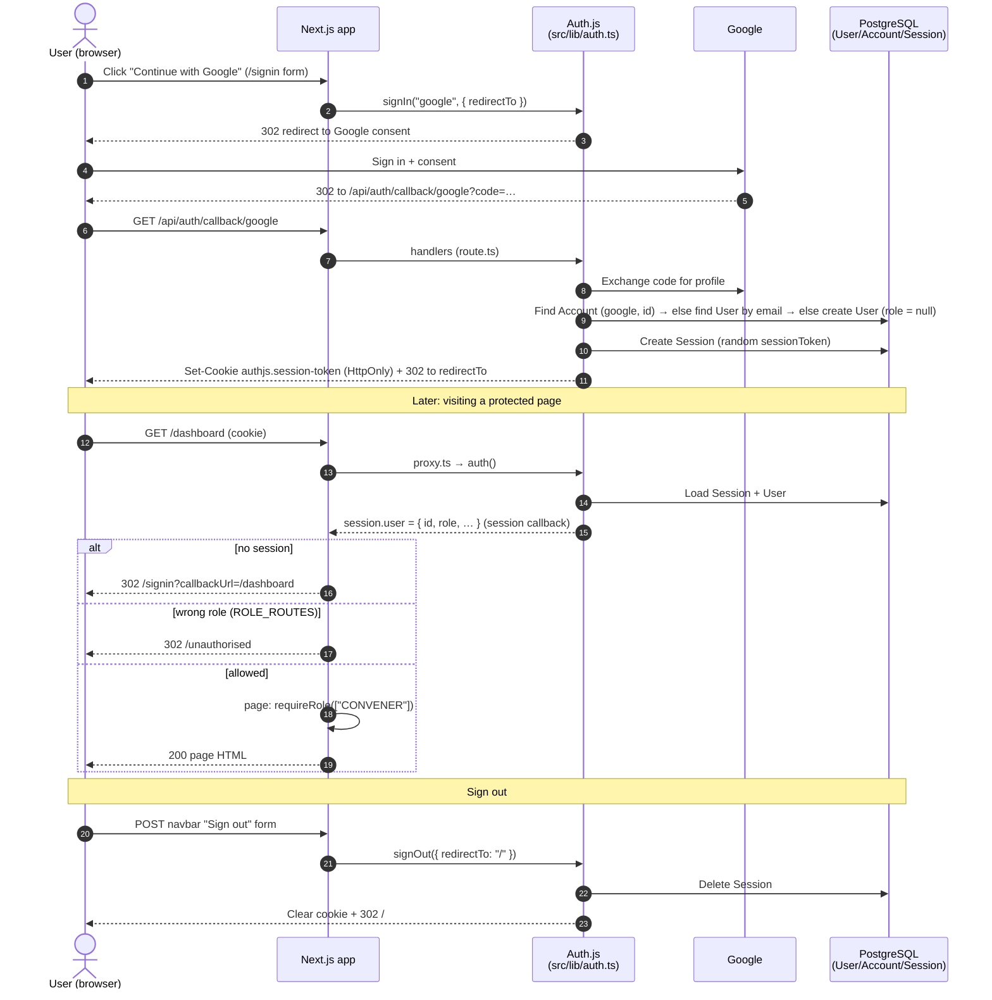
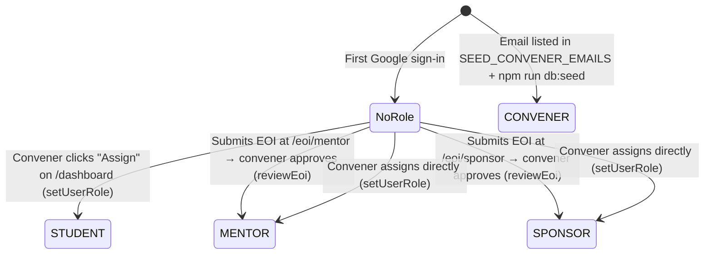

# 03 · Authentication: how sign-in, sessions and roles work

We use **Auth.js** (the `next-auth` v5 package) with **Google** as the only sign-in method.

- **No passwords:** we store no passwords and there's no sign-up form. Your first Google sign-in *is* your sign-up.
- **Database sessions:** after sign-in, a row in the `Session` table remembers you, and your browser holds a cookie with that row's random token.
- **Roles:** stored on `User.role` (`CONVENER`, `STUDENT`, `MENTOR`, `SPONSOR`, or `null` for "no access yet").

## Contents
1. [Files involved](#1-files-involved)
2. [The flows, step by step](#2-the-flows-step-by-step)
3. [The role lifecycle](#the-role-lifecycle)
4. [How pages and actions are protected](#4-how-pages-and-actions-are-protected)
5. [How to protect a new page or action](#how-to-protect-a-new-page-or-action)
6. [Getting the current user](#6-getting-the-current-user)
7. [Environment variables and secrets](#7-environment-variables-and-secrets)
8. [Making common changes safely](#8-making-common-changes-safely)
9. [Security pitfalls](#9-security-pitfalls)
10. [Troubleshooting](#10-troubleshooting)

---

## 1. Files involved

Paths are relative to `my-capstone/`.

| File | Role |
|---|---|
| `src/lib/auth.ts` | **The Auth.js config.** Google provider, `PrismaAdapter(prisma)`, `session: { strategy: "database" }`, custom sign-in page `/signin`, and the `session` callback that adds `user.id` and `user.role`. Exports `handlers`, `auth`, `signIn`, `signOut` |
| `src/app/api/auth/[...nextauth]/route.ts` | Mounts Auth.js's built-in endpoints under `/api/auth/*`, e.g. `/api/auth/callback/google`, `/api/auth/session`, `/api/auth/providers` |
| `src/proxy.ts` | Next.js 16 **Proxy** (formerly "middleware"). Runs before `/dashboard`, `/projects` and `/eoi` pages. Redirects to `/signin` if you're not signed in, or to `/unauthorised` if your role doesn't match |
| `src/lib/access.ts` | `ROLE_ROUTES` (which URL prefixes need which roles), `hasRole()`, `matchesPrefix()`. Shared by the proxy and the guards. It also exports `SIGNED_IN_ROUTES`, which is **currently unused** |
| `src/lib/authz.ts` | Server-only guards: `getCurrentUser()` (cached per request), `requireUser()` and `requireRole()` for pages (they redirect), and `authorize()` for server actions (it returns an error object instead of redirecting) |
| `src/types/next-auth.d.ts` | Adds `role` to the Auth.js `User` type and `id`/`role` to `Session.user`, so TypeScript knows about them |
| `src/app/(public)/signin/page.tsx` | The sign-in page. It shows a "Continue with Google" button, and `safeCallback()` blocks open redirects in `?callbackUrl=` |
| `src/app/(public)/unauthorised/page.tsx` | Where people without the right role land |
| `src/components/nav/navbar.tsx` | Sign-in and sign-out buttons (server-action forms). Hides nav links by role, **for convenience only** |
| `src/actions/users.ts` | `setUserRole`: a convener gives a role-less user STUDENT/MENTOR/SPONSOR |
| `src/actions/review.ts` | `reviewEoi`: approving an EOI also sets the applicant's role if they have none |
| `prisma/schema.prisma` | Auth tables `User`, `Account`, `Session`, `VerificationToken` (the standard Auth.js Prisma models) plus our `role` column and `Role` enum |
| `prisma/seed.ts` | Pre-creates **conveners** from `SEED_CONVENER_EMAILS`. This is the *only* way to create a convener |

---

## 2. The flows, step by step

### Sign-in (and first-time "sign-up")

1. The user clicks **Sign in** (navbar) or **Continue with Google** (`/signin`). Both are `<form>`s whose server action calls `signIn("google", { redirectTo })`.
2. Auth.js redirects the browser to Google's consent screen.
3. Google redirects back to **`/api/auth/callback/google`** with a one-time code. Auth.js swaps the code for the user's profile (name, email, picture).
4. `PrismaAdapter` looks for an `Account` row with `provider = "google"` and that Google account ID.
   - **Found:** that's the existing user.
   - **Not found, but a `User` with the same email exists** (e.g. a convener pre-created by the seed): the Google account is **linked** to that user. This works because `allowDangerousEmailAccountLinking: true` is set in `auth.ts`. It's safe here because Google verifies email ownership.
   - **Not found at all:** a new `User` is created with **`role = null`**, plus an `Account` row. This is "sign-up".
5. The adapter creates a `Session` row with a random `sessionToken` and an `expires` date. Auth.js's default lifetime is 30 days, refreshed daily with use; we don't override it.
6. The browser gets an **HTTP-only cookie** holding that token: `authjs.session-token`, or `__Secure-authjs.session-token` on HTTPS. It's then redirected to `redirectTo`.

### Every later request

1. For `/dashboard`, `/projects` and `/eoi/*`, **`src/proxy.ts`** runs first. `auth()` reads the cookie and loads the `Session` + `User` from the DB. The `session` callback in `auth.ts` copies `user.id` and `user.role` into `session.user`.
2. The proxy redirects if there's no user, or if the route's `ROLE_ROUTES` rule doesn't match the role.
3. The page runs `requireUser()`/`requireRole()` as a **second check**, and the navbar calls `getCurrentUser()`. `getCurrentUser` is wrapped in React `cache()`, so it's one DB lookup per request.
4. Any server action the page calls runs **`authorize([...roles])`** as a **third check**.

Because sessions are read from the DB on every request, **a role change takes effect on the user's next click**. There's no need to sign out and back in.

### Sign-out

The navbar's **Sign out** form calls `signOut({ redirectTo: "/" })`. The adapter deletes the `Session` row, the cookie is cleared, and the user lands on `/`.



---

## The role lifecycle



- A user has **one** role. `setUserRole` only works on users whose role is `null`, and `reviewEoi` refuses to overwrite a different role.
- Conveners **cannot** create other conveners from the UI (see the comment in `src/actions/users.ts`). Add their email to `SEED_CONVENER_EMAILS` and re-run the seed instead.
- There is no UI to *remove* or *change* a role yet. Use Prisma Studio locally ([02 → Studio](02-database-and-prisma.md#7-inspecting-data-with-prisma-studio)).

What each role can reach today:

| Route | Who | Enforced by |
|---|---|---|
| `/`, `/showcase`, `/signin`, `/unauthorised` | Everyone | public |
| `/eoi/mentor`, `/eoi/sponsor` | Any signed-in user | `proxy.ts` matcher + `requireUser()` + `authorize`-style check in `submitPartnerEoi` |
| `/projects` | `STUDENT` | `ROLE_ROUTES` + `requireRole(["STUDENT"])` + `authorize(["STUDENT"])` |
| `/dashboard` | `CONVENER` | `ROLE_ROUTES` + `requireRole(["CONVENER"])` + `authorize(["CONVENER"])` |

---

## 4. How pages and actions are protected

There are **three layers**. Always use at least the last two.

| Layer | Where | What happens on failure | Why |
|---|---|---|---|
| 1. Proxy | `src/proxy.ts` + `ROLE_ROUTES` in `src/lib/access.ts` | Redirect before the page renders | Fast, central, stops accidental exposure |
| 2. Page guard | `await requireUser(...)` / `await requireRole([...])` at the top of `page.tsx` | Redirect to `/signin` or `/unauthorised` | The page is safe even if someone forgets the proxy matcher |
| 3. Action guard | `const auth = await authorize([...])` at the top of every server action | Returns `{ status: "error", message }` to the form | **Server actions are public POST endpoints.** Anyone can call them directly, whatever page they're on |

> The **`(protected)` folder name does not protect anything.** Route groups in parentheses only organise files; they don't appear in the URL and have no security effect. Protection comes only from the three layers above.

> **Hiding a nav link is not security.** `NAV_ITEMS` in `navbar.tsx` says so in a comment: "Visibility here is a UX convenience only".

---

## How to protect a new page or action

Example: a new mentor-only page at `/mentoring`.

1. **Create the page** at `src/app/(protected)/mentoring/page.tsx` and guard it on the first line:
   ```tsx
   import { requireRole } from "@/lib/authz";

   export default async function MentoringPage() {
     const user = await requireRole(["MENTOR"], { callbackUrl: "/mentoring" });
     // user.id, user.role, user.email are available here
     return <h1>Hello {user.name}</h1>;
   }
   ```
   For "any signed-in user" pages, use `const user = await requireUser("/mentoring");`.

2. **Add a role rule** in `src/lib/access.ts`:
   ```ts
   export const ROLE_ROUTES: { prefix: string; roles: readonly Role[] }[] = [
     { prefix: "/dashboard", roles: ["CONVENER"] },
     { prefix: "/projects", roles: ["STUDENT"] },
     { prefix: "/mentoring", roles: ["MENTOR"] },   // NEW
   ];
   ```

3. **Add the path to the proxy matcher** in `src/proxy.ts`:
   ```ts
   export const config = {
     matcher: ["/dashboard/:path*", "/projects/:path*", "/eoi/:path*", "/mentoring/:path*"],
   };
   ```
   Next.js requires `matcher` to be a literal value it can read at build time. That's why it can't simply import `ROLE_ROUTES`, and why you must update both files.

4. **Guard every server action** the page uses:
   ```ts
   "use server";
   import { authorize } from "@/lib/authz";

   export async function doMentorThing(_prev: ActionState, formData: FormData): Promise<ActionState> {
     const auth = await authorize(["MENTOR"]);
     if (!auth.ok) return { status: "error", message: auth.error };
     const { user } = auth;
     // …validate, then query using user.id (never a user id sent from the form)
   }
   ```

5. **Optional:** show it in the navbar by adding `{ href: "/mentoring", label: "Mentoring", roles: ["MENTOR"] }` to `NAV_ITEMS` in `src/components/nav/navbar.tsx`.

6. **Test it:** signed out → redirected to `/signin`. Wrong role → `/unauthorised`. Right role → page renders.

Checklist when adding a protected route: **page guard ✔ · `ROLE_ROUTES` ✔ · proxy `matcher` ✔ · action `authorize` ✔ · nav item (optional) ✔**

---

## 6. Getting the current user

| Where you are | How | Returns |
|---|---|---|
| Server Component / `page.tsx` / `layout.tsx` (optional user) | `const user = await getCurrentUser();` from `@/lib/authz` | `{ id, name, email, image, role }` or `null` |
| `page.tsx` that must be signed in | `const user = await requireUser("/this-path");` | user (redirects if none) |
| `page.tsx` that needs a role | `const user = await requireRole(["CONVENER"], { callbackUrl: "/this-path" });` | user with a non-null `role` |
| Server Action | `const auth = await authorize(["STUDENT"]); if (!auth.ok) …; auth.user` | `{ ok, user }` or `{ ok: false, error }` |
| Server Action that allows any signed-in user | `const user = await getCurrentUser(); if (!user) return { status: "error", … }` (see `submitPartnerEoi`) | user or `null` |
| Route handler (`app/api/**/route.ts`) | `import { auth } from "@/lib/auth"; const session = await auth();` | session or `null` |
| **Client Component** (`"use client"`) | **Pass what you need as props** from the server page that renders it (see how `dashboard/page.tsx` passes `eoiId` to `ReviewEoiForm`). There's no `SessionProvider`/`useSession()` set up, and you usually don't need one | — |

`src/lib/authz.ts` starts with `import "server-only"`, so importing it into a client component fails the build. That's on purpose.

---

## 7. Environment variables and secrets

| Variable | Used by | Local value | Production value |
|---|---|---|---|
| `AUTH_SECRET` | Auth.js: signs and encrypts its cookies and tokens (CSRF, OAuth state/PKCE) | Random 32-byte string ([01 → 4.1](01-local-setup.md#41-generate-auth_secret)) | A **different** random string, only in the server's `.env` |
| `AUTH_GOOGLE_ID` / `AUTH_GOOGLE_SECRET` | Google provider (Auth.js reads them automatically, by name) | Your personal Google Cloud OAuth client ([01 → 4.2](01-local-setup.md#42-create-your-own-google-oauth-client)) | A separate **production** OAuth client with the production redirect URI |
| `AUTH_TRUST_HOST` | Lets Auth.js trust the `Host` header when running behind a proxy/container | not needed (`next dev` trusts localhost) | `true`. `docker-compose.prod.yml` sets it by default |
| `AUTH_URL` | The public base URL, if Auth.js can't infer it | not needed | Optional, e.g. `https://your-domain.example` |
| `DATABASE_URL` | Prisma adapter (sessions and users live in the DB) | see [01](01-local-setup.md) | built by `docker-compose.prod.yml` |
| `SEED_CONVENER_EMAILS` | `prisma/seed.ts` | your Google email | the real convener emails |

### Rotating secrets

Rotate a secret if it was committed, pasted somewhere public, or a team member leaves.

**`AUTH_SECRET`**
1. Generate a new one: `node -e "console.log(require('crypto').randomBytes(32).toString('base64'))"`.
2. Replace the value in `.env`. On the server, edit `~/9785_Group53B/my-capstone/.env` and restart:
   ```
   docker compose -f docker-compose.prod.yml up -d
   ```
3. Anyone halfway through signing in has to try again. Because we use database sessions, existing sessions are stored in the DB and may keep working. To force **everyone** to sign in again, delete all sessions:
   ```
   docker compose -f docker-compose.prod.yml exec db sh -c 'psql -U "$POSTGRES_USER" -d "$POSTGRES_DB" -c "DELETE FROM \"Session\";"'
   ```
   Locally, you can do the same in Prisma Studio.

**Google client secret**
1. Google Cloud Console → APIs & Services → Credentials (or Google Auth Platform → Clients) → your client.
2. Add a new secret (or reset it), and copy it into `AUTH_GOOGLE_SECRET`.
3. Restart the app, check that sign-in works, then **disable/delete the old secret** in the console.

**If a secret was committed to Git:** rotate it first. Deleting the commit isn't enough, because it's in the history and possibly in forks.

---

## 8. Making common changes safely

### Add a field to the user (e.g. `studentNumber`)
1. In `prisma/schema.prisma`, add `studentNumber String? @unique` to `model User`. Keep it optional: Google sign-in creates users without it.
2. Run `npm run db:migrate -- --name add_user_student_number`, then `npx prisma generate`.
3. **If pages need it from the session**, add it in two places:
   - the `session` callback in `src/lib/auth.ts`:
     ```ts
     session.user.studentNumber = user.studentNumber ?? null;
     ```
   - the types in `src/types/next-auth.d.ts`:
     ```ts
     interface User { role?: Role | null; studentNumber?: string | null }
     interface Session { user: { id: string; role: Role | null; studentNumber: string | null } & DefaultSession["user"] }
     ```

   Otherwise, just query it: `prisma.user.findUnique({ where: { id: user.id }, select: { studentNumber: true } })`.
4. Let users set it through a form + server action that uses **`user.id` from `getCurrentUser()`**, never a user id from the form.

### Add a new role (e.g. `ADMIN`, from `RoleDefinitions.txt`)
1. Add `ADMIN` to `enum Role` in `schema.prisma`. Migrate and generate.
2. Search for every place roles are listed and decide whether each one should include `ADMIN`:
   ```
   git grep -n -E "CONVENER|ROLE_ROUTES|PARTICIPANT_ROLES|z.enum\(\[\"STUDENT\""
   ```
   That covers:
   - `src/lib/access.ts` (`ROLE_ROUTES`)
   - `src/components/nav/navbar.tsx` (`NAV_ITEMS`)
   - `requireRole([...])` / `authorize([...])` calls in pages and actions
   - `src/actions/users.ts` (`setRoleSchema`)
   - `src/app/(public)/page.tsx` (`PARTICIPANT_ROLES`)
   - `prisma/seed.ts`
3. For "admin can do everything", pass both roles: `requireRole(["CONVENER", "ADMIN"])`.
4. **Several roles per user** (which `RoleDefinitions.txt` hints at) means changing `role Role?` to `roles Role[]` and updating `hasRole()` and every check. Plan that as its own feature.

### Add or change a login provider
- **Another OAuth provider** (e.g. GitHub, or Microsoft Entra ID for university accounts):
  1. Import it in `src/lib/auth.ts`, e.g. `import GitHub from "next-auth/providers/github";`, and add `GitHub` to `providers`.
  2. Add `AUTH_GITHUB_ID` / `AUTH_GITHUB_SECRET` to `.env` and `.env.example` (placeholders only).
  3. Register the callback URL `http://localhost:3000/api/auth/callback/github` with the provider.
  4. Add a button. `"google"` is hard-coded in `src/app/(public)/signin/page.tsx` and in the navbar's Sign in form.
  5. **Don't** set `allowDangerousEmailAccountLinking` on a provider unless it guarantees verified emails.
- **Email + password ("Credentials" provider):** Auth.js's Credentials provider **doesn't work with `strategy: "database"`**, which we rely on for instant role changes. It also makes us responsible for password hashing, resets and brute-force protection. Talk to the team before going down this path.
- **Removing Google:** existing users' `Account` rows stay, but they can't sign in until they have another linked provider.

---

## 9. Security pitfalls

1. **Every server action must authorise itself.** A form being on a convener-only page doesn't protect its action.
2. **Never trust IDs from the browser** (hidden inputs, URL params). Use `user.id` from the session for "who". For "what", re-check ownership and state in the DB; see `submitStudentEoi`, which re-checks the project's status.
3. **Validate all input with zod** (`src/lib/validation/`) before touching the DB.
4. **Use guarded updates for state changes**, e.g. `updateMany({ where: { id, status: "PENDING" } })` in `review.ts`, and use transactions for multi-step writes. That stops double-submits and races.
5. **Only redirect to relative paths.** Reuse the `safeCallback()` pattern from `signin/page.tsx` for any `callbackUrl`-style parameter (it prevents open redirects).
6. **Don't expose private fields.** Use `select` to return only what the page shows. Never send `Account` tokens or `Session` rows to the client.
7. **Keep `import "server-only"`** in files that hold secrets or DB access.
8. **Never commit `.env`.** Never put secrets in `NEXT_PUBLIC_*` variables, because those are sent to the browser.
9. **`allowDangerousEmailAccountLinking`** is only safe with providers that verify email ownership (Google does).
10. **Production must use HTTPS.** Session cookies over plain HTTP can be stolen on shared networks.

---

## 10. Troubleshooting

| Symptom | Fix |
|---|---|
| `Error 400: redirect_uri_mismatch` from Google | The redirect URI in Google Cloud must be exactly `<base-url>/api/auth/callback/google`, e.g. `http://localhost:3000/api/auth/callback/google`. |
| `[auth][error] MissingSecret` | Set `AUTH_SECRET` in `.env` and restart `npm run dev`. |
| `[auth][error] UntrustedHost` in production | Set `AUTH_TRUST_HOST=true` (already the default in `docker-compose.prod.yml`), or set `AUTH_URL`. |
| `[auth][error] OAuthAccountNotLinked` | A user with that email exists but is linked to a different provider, and linking isn't allowed for this one. Only happens once a second provider exists. |
| `[auth][error] AdapterError` / `P2021 The table "public.Session" does not exist` | Run migrations: `npm run db:migrate`. |
| `InvalidCheck: pkceCodeVerifier value could not be parsed` | Usually cookies from an old `AUTH_SECRET`, or mixing `localhost` and `127.0.0.1`. Clear cookies for localhost and always use `http://localhost:3000`. |
| Signed in, but always sent to `/unauthorised` | Your `User.role` is `null` or a different role. Check it in Prisma Studio; conveners come from `SEED_CONVENER_EMAILS` + `npm run db:seed`. |
| Seeded convener signs in but has no role | The Google email doesn't exactly match (the seed lower-cases emails), or the seed ran against a different DB. Re-run `npm run db:seed` and check the `User` table. |
| Role changed in the DB, but the UI looks old | Refresh. With database sessions it's re-read on every request. |
| `You're importing a component that needs "server-only"` (or build errors about `pg`, `fs`, `net` modules) | You imported `@/lib/authz`, `@/lib/auth` or `@/lib/prisma` into a `"use client"` file. Fetch the data in the server page and pass it as props. |
| `/dashboard` crashes with `SetRoleForm is not defined` | Known bug; see [README → Known issues](README.md#known-issues-to-be-aware-of-as-of-this-writing). |
