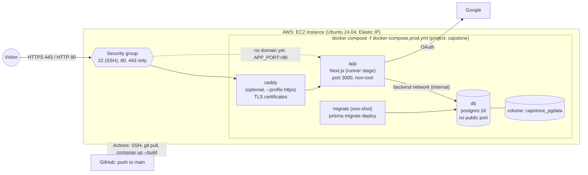

# 05 · Hosting on AWS EC2 with Docker Compose

This guide puts the app on the internet: one **EC2** virtual server, running the app and the database in **separate Docker containers** managed by **Docker Compose**, and deployed from our GitHub repo.

> **Who does this?** One or two people (Laiba owns hosting). Everyone else should still read [§12 Operations](#12-operations-logs-restarts-rollbacks-backups) so they can check logs.
> **Time:** about 2 hours the first time.
> **Cost:** roughly US$20–30/month while running. Read [§13](#13-costs-and-avoiding-surprise-charges) **before** you launch anything.

## Contents
1. [Architecture](#1-architecture)
2. [The deployment files in this repo](#2-the-deployment-files-in-this-repo)
3. [Create the EC2 instance](#3-create-the-ec2-instance)
4. [Attach an Elastic IP](#4-attach-an-elastic-ip)
5. [SSH into the server](#5-ssh-into-the-server)
6. [Prepare the server (updates, swap)](#6-prepare-the-server-updates-swap)
7. [Install Docker and the Compose plugin](#7-install-docker-and-the-compose-plugin)
8. [Get the code and create the server `.env`](#8-get-the-code-and-create-the-server-env)
9. [First deploy (manual)](#9-first-deploy-manual)
10. [Automated deploys with GitHub Actions](#10-automated-deploys-with-github-actions)
11. [Domain, HTTPS and Google sign-in](#11-optional-but-needed-for-google-sign-in-domain--https-with-caddy)
12. [Operations: logs, restarts, rollbacks, backups](#12-operations-logs-restarts-rollbacks-backups)
13. [Costs and avoiding surprise charges](#13-costs-and-avoiding-surprise-charges)
14. [Optional: a smaller image with standalone output](#14-optional-a-smaller-image-with-standalone-output)
15. [Troubleshooting](#15-troubleshooting)

---

## 1. Architecture



- **Only ports 22, 80 and 443 are open** in the AWS security group. Postgres (5432) is **never** exposed: the `db` service has no `ports:` and sits on an `internal` Docker network.
- **The database's data lives in a named volume** (`capstone_pgdata`), so rebuilding or replacing containers doesn't lose data.
- **Migrations run automatically** on every deploy (the `migrate` service) before the new app starts.

---

## 2. The deployment files in this repo

| File | Purpose |
|---|---|
| `my-capstone/Dockerfile` | Multi-stage build. `deps` → `builder` (runs `prisma generate` + `next build`) → `prod-deps` → **`runner`** (final image: production deps only, runs as the non-root `node` user, has a health check). A separate **`migrator`** target keeps the Prisma CLI for migrations and seeding |
| `my-capstone/.dockerignore` | Keeps `node_modules`, `.next`, `.env*` and `.git` out of the build, so **secrets never end up in an image** |
| `my-capstone/docker-compose.prod.yml` | Production stack: `db`, `migrate`, `app`, optional `caddy`. Named volumes, private network, health checks, `restart: unless-stopped`, values from the server's `.env` |
| `my-capstone/Caddyfile` | HTTPS reverse-proxy config for the optional `caddy` service (the domain comes from `.env`) |
| `.github/workflows/deploy.yml` | On push to `main`, SSHes into the server and redeploys |
| `my-capstone/.env.example` | Template, including a commented **"Production server only"** section |
| `my-capstone/docker-compose.yml` | ⚠️ **Local development database only**, not used on the server. Always pass `-f docker-compose.prod.yml` on the server so you never start the dev file by mistake |

These were tested locally with Docker 29 / Compose v5 (build, migrate, seed, health checks, auth redirect, non-root user, backup/restore). The AWS-specific steps below could not be tested from a laptop, so please report anything that doesn't match what you see.

---

## 3. Create the EC2 instance

1. Sign in to the AWS console: <https://console.aws.amazon.com/>. In the top-right, choose the region **Asia Pacific (Sydney) `ap-southeast-2`**. It's closest to our users; stay in the same region for everything below.
2. **Set up a billing alert first** ([§13.2](#132-set-a-budget-alert-do-this-first)).
3. Go to **EC2 → Instances → Launch instances**.
4. **Name:** `capstone-prod`.
5. **Application and OS image:** **Ubuntu** → **Ubuntu Server 24.04 LTS (HVM), SSD Volume Type**, **64-bit (x86)**.
6. **Instance type:** **`t3.small`** (2 vCPU, 2 GiB RAM).
   - `t3.micro` (1 GiB) is too small to run `next build` on the server.
   - If builds still run out of memory with swap ([§6](#6-prepare-the-server-updates-swap)), use `t3.medium`.
   - If your account is on the AWS Free Tier / free plan, check which types show **"Free tier eligible"**; the rules changed in 2025.
7. **Key pair (login):** **Create new key pair**.
   - Name: `capstone-key`. Type: **ED25519**. Format: **.pem**.
   - It downloads once. **Keep it safe; never commit it or share it in chat.** Give it only to the person/people who administer the server.
8. **Network settings → Edit:**
   - Auto-assign public IP: **Enable**.
   - Firewall: **Create security group**. Name it `capstone-web-sg` and add these **inbound rules only**:

   | Type | Port | Source | Why |
   |---|---|---|---|
   | SSH | 22 | **My IP** (see note in [§10](#10-automated-deploys-with-github-actions)) | Admin access |
   | HTTP | 80 | Anywhere-IPv4 `0.0.0.0/0` | Website, and HTTPS certificate checks |
   | HTTPS | 443 | Anywhere-IPv4 `0.0.0.0/0` | Website over HTTPS |

   ❌ **Do not add 5432 (Postgres) or 3000.** The database must never be reachable from the internet.
9. **Configure storage:** **30 GiB**, **gp3**.
10. **Launch instance.** Wait until **Instance state = Running** and **Status checks = 2/2 passed**.

---

## 4. Attach an Elastic IP

A normal public IP changes every time the instance is stopped and started. An **Elastic IP** stays fixed, which matters for DNS, SSH and GitHub Actions.

1. **EC2 → Network & Security → Elastic IPs → Allocate Elastic IP address → Allocate.**
2. Select it → **Actions → Associate Elastic IP address**. Choose the instance `capstone-prod` → **Associate**.
3. Write down the address (e.g. `203.0.113.10`). Below it's written as **`<EIP>`**.

> 💲 AWS charges for every public IPv4 address, **including Elastic IPs, and including ones not attached to anything**. Release it when the project ends ([§13.4](#134-end-of-semester-shutdown-checklist)).

---

## 5. SSH into the server

The default user on Ubuntu AMIs is **`ubuntu`**.

**Windows (PowerShell, built-in OpenSSH)**
1. Move the key into your `.ssh` folder and lock its permissions. OpenSSH refuses keys that other users can read.
   ```powershell
   PS> mkdir $env:USERPROFILE\.ssh -Force
   PS> Move-Item $env:USERPROFILE\Downloads\capstone-key.pem $env:USERPROFILE\.ssh\
   PS> $key = "$env:USERPROFILE\.ssh\capstone-key.pem"
   PS> icacls $key /inheritance:r
   PS> icacls $key /grant:r "$($env:USERNAME):(R)"
   ```
2. Connect:
   ```powershell
   PS> ssh -i $env:USERPROFILE\.ssh\capstone-key.pem ubuntu@<EIP>
   ```

**macOS / Linux**
```bash
mv ~/Downloads/capstone-key.pem ~/.ssh/
chmod 400 ~/.ssh/capstone-key.pem
ssh -i ~/.ssh/capstone-key.pem ubuntu@<EIP>
```

Type `yes` to trust the host the first time.

**Shortcut (all OSes):** add this to `~/.ssh/config` (Windows: `%USERPROFILE%\.ssh\config`):
```
Host capstone
    HostName <EIP>
    User ubuntu
    IdentityFile ~/.ssh/capstone-key.pem
```
Then just run:
```
ssh capstone
```

**Copying files** (e.g. downloading a backup to your laptop):
```
scp capstone:~/backups/appdb-2026-09-30.dump .
```

---

## 6. Prepare the server (updates, swap)

Run these **on the server** (your prompt shows `ubuntu@ip-…`).

1. Update packages:
   ```bash
   sudo apt update && sudo apt upgrade -y
   sudo timedatectl set-timezone Australia/Sydney
   ```
   If it says a reboot is required, run `sudo reboot`, wait a minute, and SSH back in.

2. **Add 2 GB of swap.** Building Next.js needs more memory than 2 GiB of RAM provides:
   ```bash
   sudo fallocate -l 2G /swapfile
   sudo chmod 600 /swapfile
   sudo mkswap /swapfile
   sudo swapon /swapfile
   echo '/swapfile none swap sw 0 0' | sudo tee -a /etc/fstab
   free -h
   ```
   `free -h` should now show `Swap: 2.0Gi`.

3. Security updates install automatically on Ubuntu (`unattended-upgrades`, on by default). Password login over SSH is disabled on AWS Ubuntu images, so only keys work. Keep it that way.

> **Don't rely on `ufw` alone.** Ports published by Docker bypass `ufw` rules. The **AWS security group** is our firewall; that's why the compose file publishes as little as possible.

---

## 7. Install Docker and the Compose plugin

These are the official Docker instructions for Ubuntu (<https://docs.docker.com/engine/install/ubuntu/>). Don't use the older `docker.io` or `docker-compose` apt packages.

```bash
sudo apt-get update
sudo apt-get install -y ca-certificates curl
sudo install -m 0755 -d /etc/apt/keyrings
sudo curl -fsSL https://download.docker.com/linux/ubuntu/gpg -o /etc/apt/keyrings/docker.asc
sudo chmod a+r /etc/apt/keyrings/docker.asc
echo "deb [arch=$(dpkg --print-architecture) signed-by=/etc/apt/keyrings/docker.asc] https://download.docker.com/linux/ubuntu $(. /etc/os-release && echo "${UBUNTU_CODENAME:-$VERSION_CODENAME}") stable" | sudo tee /etc/apt/sources.list.d/docker.list > /dev/null
sudo apt-get update
sudo apt-get install -y docker-ce docker-ce-cli containerd.io docker-buildx-plugin docker-compose-plugin
```

Let the `ubuntu` user run Docker without `sudo`, and cap log file sizes so logs can't fill the disk:
```bash
sudo usermod -aG docker ubuntu
echo '{ "log-driver": "json-file", "log-opts": { "max-size": "10m", "max-file": "3" } }' | sudo tee /etc/docker/daemon.json
sudo systemctl restart docker
exit
```

SSH back in so the group change applies, then check:
```bash
docker --version
docker compose version
docker run --rm hello-world
```

Docker starts automatically after a reboot.

---

## 8. Get the code and create the server `.env`

1. Clone the repo into the home folder. The repo is public, so no login is needed. The automated deploy expects **exactly** `~/9785_Group53B/my-capstone`.
   ```bash
   cd ~
   git clone https://github.com/sc-u3226864/9785_Group53B.git
   cd ~/9785_Group53B/my-capstone
   ```
   *If the repo is made private later:*
   1. Create a read-only **deploy key** on the server: `ssh-keygen -t ed25519 -f ~/.ssh/github_deploy -N ""`.
   2. Add `~/.ssh/github_deploy.pub` under GitHub → repo **Settings → Deploy keys**.
   3. Clone via SSH.

2. Create the server's `.env` from the template:
   ```bash
   cp .env.example .env
   chmod 600 .env
   nano .env
   ```

3. Generate strong values **on the server**. Run these and paste the outputs into `.env`:
   ```bash
   openssl rand -hex 24      # POSTGRES_PASSWORD (hex = URL-safe)
   openssl rand -base64 32   # AUTH_SECRET
   ```

4. Fill `.env` in like this. **Your own values go in `<…>`; never copy real values into Git, chat or docs.**
   ```ini
   POSTGRES_USER=capstone
   POSTGRES_PASSWORD=<output of openssl rand -hex 24>
   POSTGRES_DB=appdb
   # DATABASE_URL is ignored on the server: docker-compose.prod.yml builds it with host "db"
   DATABASE_URL=unused-on-server

   AUTH_SECRET=<output of openssl rand -base64 32>
   AUTH_GOOGLE_ID=<production OAuth client ID, see §11>
   AUTH_GOOGLE_SECRET=<production OAuth client secret, see §11>

   SEED_CONVENER_EMAILS=<real convener Google emails, comma-separated>

   AUTH_TRUST_HOST=true

   # --- Choose ONE of these blocks ---
   # (a) No domain yet: serve plain HTTP on port 80
   APP_BIND=0.0.0.0
   APP_PORT=80
   # (b) With a domain + HTTPS (see §11): delete block (a) and use
   # DOMAIN=<your-domain>
   # AUTH_URL=https://<your-domain>
   # COMPOSE_PROFILES=https
   ```
   Save in nano with `Ctrl+O`, `Enter`, then `Ctrl+X`.

> **Important:** Postgres creates the user and password **only the first time** the `capstone_pgdata` volume is created. Changing `POSTGRES_PASSWORD` later won't change the real password; see [Troubleshooting](#15-troubleshooting).

---

## 9. First deploy (manual)

From `~/9785_Group53B/my-capstone` on the server:

1. Build and start everything. The first build takes about 5–10 minutes on a `t3.small`.
   ```bash
   docker compose -f docker-compose.prod.yml up -d --build
   ```
   The order is automatic: `db` becomes healthy → `migrate` applies migrations and exits → `app` starts.

2. Check the status:
   ```bash
   docker compose -f docker-compose.prod.yml ps -a
   ```
   You want:
   - `db` … `Up … (healthy)`
   - `migrate` … `Exited (0)`
   - `app` … `Up … (healthy)` (it shows `health: starting` for up to 30 seconds)

3. Check the migration output:
   ```bash
   docker compose -f docker-compose.prod.yml logs migrate
   ```
   Look for `All migrations have been successfully applied.` (or `No pending migrations to apply.` on later deploys).

4. **Seed once**. This creates the conveners listed in `SEED_CONVENER_EMAILS`, plus the sample projects and post:
   ```bash
   docker compose -f docker-compose.prod.yml run --rm migrate npx prisma db seed
   ```
   Expected: `Seeded N convener(s), 2 projects, 1 post.` Delete the sample projects later if you don't want them.

5. Test from the server itself, then from your laptop's browser:
   ```bash
   curl -I http://localhost:${APP_PORT:-80}/
   ```
   Open `http://<EIP>/`. You should see "Industry projects, built by students", and `/showcase` should list the welcome post.

> ⚠️ **Google sign-in will not work at `http://<EIP>`.** Google only accepts `https://` redirect URIs on real domain names (plain `http` is allowed for `localhost` only). Public pages work. For sign-in, do [§11](#11-optional-but-needed-for-google-sign-in-domain--https-with-caddy).

**Why `migrate deploy` and not `migrate dev`?**
- `deploy` only applies migration files that were reviewed and merged. It never generates new SQL, never prompts, and never resets the database.
- `migrate dev` is a development tool: it can create migrations from schema differences and offer to **wipe** the database.

More in [02 → §9](02-database-and-prisma.md#9-how-migrations-reach-production).

---

## 10. Automated deploys with GitHub Actions

`.github/workflows/deploy.yml` runs on every push to `main` that changes `my-capstone/**` (or the workflow itself), and on demand from the **Actions** tab. It:
1. SSHes into the server.
2. Runs `git pull --ff-only origin main` in `~/9785_Group53B/my-capstone`.
3. Runs `docker compose -f docker-compose.prod.yml up -d --build --remove-orphans`, which also runs new migrations.
4. Prunes old images.

Only one deploy runs at a time.

### 10.1 Create a dedicated deploy key
Do this **on your laptop**, not with the main admin key. Don't set a passphrase; GitHub can't type one.
```
ssh-keygen -t ed25519 -f capstone-deploy -N "" -C "github-actions-deploy"
```
This creates `capstone-deploy` (private) and `capstone-deploy.pub` (public).

Add the **public** key to the server:
```
scp capstone-deploy.pub capstone:~/
ssh capstone "cat ~/capstone-deploy.pub >> ~/.ssh/authorized_keys && rm ~/capstone-deploy.pub"
```

Test it:
```
ssh -i capstone-deploy ubuntu@<EIP> "echo ok"
```

### 10.2 Add GitHub secrets and a variable
Repo → **Settings → Secrets and variables → Actions**:

| Kind | Name | Value |
|---|---|---|
| Secret | `EC2_HOST` | `<EIP>` (or your domain) |
| Secret | `EC2_USER` | `ubuntu` |
| Secret | `EC2_SSH_KEY` | The **entire** contents of the private `capstone-deploy` file, including the `-----BEGIN…` and `-----END…` lines |
| Variable (**Variables** tab) | `DEPLOY_ENABLED` | `true` |

Until `DEPLOY_ENABLED` is `true`, the workflow is **skipped** (not failed), so merges before the server exists don't produce red crosses.

After adding the secret, **delete the private key file from your laptop**, or store it in a password manager.

### 10.3 Allow GitHub to reach port 22
GitHub-hosted runners connect from a large, changing set of IP addresses, so an SSH rule limited to "My IP" blocks them. The options:

| Option | Effort | Notes |
|---|---|---|
| **A. Open SSH (22) to `0.0.0.0/0`** in `capstone-web-sg` | Easy (recommended for this project) | Safe enough **because password login is disabled and only keys work**. Keep the keys secret. Optional extra: `sudo apt install fail2ban` |
| B. Keep SSH restricted and deploy manually | None | Run the §9 command yourself after merging |
| C. AWS Systems Manager or a self-hosted runner | Advanced | Avoids inbound SSH entirely. Not covered here. Self-hosted runners on **public** repos are risky |

### 10.4 Try it
1. Repo → **Actions → Deploy to EC2 → Run workflow** (branch `main`).
2. Open the run and expand the step. The log ends with the `docker compose ps` table.

From now on, **merging a PR into `main` deploys it**. So:
- Don't merge on Friday night before a demo.
- Watch the Actions tab after merging.

> Never edit files in `~/9785_Group53B` on the server by hand (except `.env`). The next `git pull --ff-only` will fail if tracked files were changed. Make changes via PRs.

---

## 11. (Optional, but needed for Google sign-in) Domain + HTTPS with Caddy

Our domain isn't decided yet. When it is:

### 11.1 Point the domain at the server
At your domain registrar's DNS settings, create an **A record** that points your hostname (e.g. `projects.example.com`) at `<EIP>`. Check it from your laptop; it should print `<EIP>`:
```
nslookup projects.example.com
```

### 11.2 Switch `.env` to HTTPS mode
On the server, edit `~/9785_Group53B/my-capstone/.env`:
1. **Remove** the `APP_BIND` and `APP_PORT` lines. The app goes back to `127.0.0.1:3000`, and Caddy reaches it over the Docker network instead.
2. Add:
   ```ini
   DOMAIN=projects.example.com
   AUTH_URL=https://projects.example.com
   COMPOSE_PROFILES=https
   ```
3. Apply:
   ```bash
   docker compose -f docker-compose.prod.yml up -d
   docker compose -f docker-compose.prod.yml logs -f caddy
   ```

`COMPOSE_PROFILES=https` in `.env` makes every `docker compose` command (including the GitHub Actions deploy) include the `caddy` service. Caddy automatically gets and renews a free Let's Encrypt certificate; watch for `certificate obtained successfully`. Ports 80 and 443 must be open, and DNS must already point to the server.

Visit `https://projects.example.com`.

### 11.3 Create the production Google OAuth client
Use a **separate** Google Cloud project or client from everyone's dev clients, owned by the team account if possible.
1. Google Cloud Console → **Google Auth Platform / APIs & Services → Clients → Create client → Web application**.
2. **Authorised JavaScript origins:** `https://projects.example.com`
3. **Authorised redirect URIs:** `https://projects.example.com/api/auth/callback/google`
4. Put the ID and secret into the server `.env` (`AUTH_GOOGLE_ID`, `AUTH_GOOGLE_SECRET`), then run:
   ```bash
   docker compose -f docker-compose.prod.yml up -d
   ```
5. **Audience → Publish app**, so any Google account can sign in, not just test users. We only use the basic `openid`/`email`/`profile` scopes, which normally don't need Google's verification review.

### 11.4 No domain yet?
- **Cheapest reliable option:** buy a domain (roughly US$10–15/year for a `.com`; check your uni's options too). You can use Route 53 or any registrar.
- **Free, unverified option:** wildcard DNS services like `sslip.io`, e.g. `203-0-113-10.sslip.io`, resolve to your IP, and Caddy can get a certificate for them. **We haven't tested whether Google accepts these as OAuth redirect URIs.** Try it before relying on it.
- Raw `http://<EIP>` works for public pages and demos of everything except sign-in.

---

## 12. Operations: logs, restarts, rollbacks, backups

All commands run on the server in `~/9785_Group53B/my-capstone`. Tip: create an alias so you can type `dc` instead of the long command:
```bash
echo "alias dc='docker compose -f docker-compose.prod.yml'" >> ~/.bashrc && source ~/.bashrc
```
Full commands are shown below anyway.

### Viewing status and logs
```bash
docker compose -f docker-compose.prod.yml ps -a              # what's running, health
docker compose -f docker-compose.prod.yml logs -f app        # follow app logs (Ctrl+C to stop)
docker compose -f docker-compose.prod.yml logs --tail 100 db # last 100 DB log lines
docker compose -f docker-compose.prod.yml logs migrate       # last migration run
docker stats --no-stream                                     # CPU / memory per container
df -h / && docker system df                                  # disk space
```

### Restarting
```bash
docker compose -f docker-compose.prod.yml restart app        # restart just the app
docker compose -f docker-compose.prod.yml up -d              # re-apply .env changes (recreates changed containers)
docker compose -f docker-compose.prod.yml up -d --build      # rebuild from current code (what the deploy does)
docker compose -f docker-compose.prod.yml down               # stop and remove containers (DATA IS KEPT)
```

Reboot-safe: `restart: unless-stopped` brings containers back after the instance reboots or Docker restarts.

### Rolling back a bad deploy
**Preferred: revert on GitHub.** Open the merged PR → **Revert** → merge the revert PR. The Action redeploys the previous code. This keeps the server and `main` in sync.

**Emergency (on the server):**
```bash
git log --oneline -5                     # find the last good commit, e.g. a1b2c3d
git checkout a1b2c3d
docker compose -f docker-compose.prod.yml up -d --build
```
Later, once the fix is merged, go back to tracking `main`:
```bash
git checkout main
git pull --ff-only origin main
```

> ⚠️ **Rolling back code does not roll back the database.** Migrations only go forward. If a bad migration dropped or damaged data, restore from a backup (below), then fix forward with a new migration.

### Backing up and restoring the database

**Take a backup** (a compressed custom-format dump):
```bash
mkdir -p ~/backups
docker compose -f docker-compose.prod.yml exec -T db sh -c 'pg_dump -U "$POSTGRES_USER" -d "$POSTGRES_DB" -Fc' > ~/backups/appdb-$(date +%F).dump
ls -lh ~/backups
```

**Copy it off the server.** Backups on the same disk die with the instance. Run this on your laptop:
```
scp capstone:~/backups/appdb-2026-09-30.dump .
```

**Automatic daily backups, keeping 14 days:**
```bash
crontab -e
```
Choose nano, then add this line:
```
0 3 * * * cd ~/9785_Group53B/my-capstone && docker compose -f docker-compose.prod.yml exec -T db sh -c 'pg_dump -U "$POSTGRES_USER" -d "$POSTGRES_DB" -Fc' > ~/backups/appdb-$(date +\%F).dump && find ~/backups -name 'appdb-*.dump' -mtime +14 -delete
```

**Restore a backup** (⚠️ replaces the current data in the tables it contains):
```bash
docker compose -f docker-compose.prod.yml stop app
docker compose -f docker-compose.prod.yml exec -T db sh -c 'pg_restore -U "$POSTGRES_USER" -d "$POSTGRES_DB" --clean --if-exists' < ~/backups/appdb-2026-09-30.dump
docker compose -f docker-compose.prod.yml start app
```
This backup/restore pair was tested against this stack locally.

### What happens to data when containers change

| Action | Database data |
|---|---|
| `up -d --build`, `restart`, `down`, instance reboot, stop/start | ✅ Kept (it's in the `capstone_pgdata` volume) |
| `docker compose -f docker-compose.prod.yml down -v` | ❌ **Deleted.** `-v` removes volumes. Never use it on the server |
| `docker volume rm capstone_pgdata` / `docker system prune --volumes` | ❌ **Deleted** |
| **Terminating** the EC2 instance | ❌ **Deleted** (the disk is removed with it). Keep off-server backups |

Safe clean-up when the disk fills with old images and build cache:
```bash
docker image prune -f
docker builder prune -f
```

### Stopping and starting the instance
In the EC2 console, select the instance → **Instance state → Stop** (or **Start**). The Elastic IP stays attached and containers come back automatically on start.

---

## 13. Costs and avoiding surprise charges

### 13.1 Rough monthly cost (Sydney, on-demand, running 24/7)

Approximate figures; check the AWS Pricing Calculator (<https://calculator.aws/>) for current numbers.

| Item | Approx. US$/month |
|---|---|
| `t3.small` instance | ~$19 |
| 30 GiB gp3 disk | ~$3 |
| Public IPv4 / Elastic IP | ~$3.60 |
| Data transfer (low traffic) | ~$0–1 |
| **Total** | **≈ $25–27** |

- **Stopping** the instance stops the instance-hour charge. **Disk and Elastic IP charges continue.**
- New AWS accounts may have Free Tier credits; check **Billing → Free Tier / Credits**.

### 13.2 Set a budget alert (do this first)
1. AWS console → search **Budgets** → **Create budget** → **Use a template** → **Monthly cost budget**.
2. Budget amount, e.g. **US$30**. Email recipients: the team's shared inbox and the account owner. **Create budget.**
3. Optional: also create the **Zero spend budget** template to get an email the moment anything costs money.
4. In **Billing → Billing preferences**, turn on **Free Tier usage alerts**.

### 13.3 Habits that avoid surprises
- One region only (Sydney). Check the region selector before creating anything.
- Don't create NAT gateways, load balancers, RDS databases or extra Elastic IPs for this project. Our setup doesn't need them, and they cost money even when idle.
- Review **Billing → Bills** weekly during the semester.

### 13.4 End-of-semester shutdown checklist
1. Take a final backup and copy it off the server ([§12](#backing-up-and-restoring-the-database)).
2. EC2 → Instances → **Terminate** `capstone-prod`.
3. EC2 → Elastic IPs → **Release** the address. It's charged even when unattached.
4. EC2 → Volumes / Snapshots: delete any left over.
5. Delete the GitHub secrets, or set `DEPLOY_ENABLED` to `false`.
6. Remove the production OAuth client in Google Cloud if you're shutting it down.

---

## 14. Optional: a smaller image with standalone output

The current `runner` image is about **1.3 GB**, because it copies production `node_modules`. Next.js can instead output a trimmed "standalone" server (usually a few hundred MB). This needs a one-line change to the existing `my-capstone/next.config.ts`, which we haven't made yet:
```ts
const nextConfig: NextConfig = {
  output: "standalone",
};
```
The `runner` stage would then copy `.next/standalone`, `.next/static` and `public`, and start with `node server.js`. See `node_modules/next/dist/docs/01-app/03-api-reference/05-config/01-next-config-js/output.md`. Test it locally with the compose file before deploying.

---

## 15. Troubleshooting

| Symptom | Cause / fix |
|---|---|
| `ssh: connect to host … port 22: Operation timed out` | The security group doesn't allow your current IP. Your IP changes between home, uni and hotspot; edit the SSH rule back to **My IP**. Also check you're using the Elastic IP. |
| `WARNING: UNPROTECTED PRIVATE KEY FILE!` / `Permission denied (publickey)` | Fix key permissions ([§5](#5-ssh-into-the-server)). Use user `ubuntu` and the right `.pem`. |
| `permission denied while trying to connect to the Docker daemon socket` | You weren't in the `docker` group yet. Log out and SSH back in (after `usermod -aG docker ubuntu`). |
| Build stops with `Killed` or exit code **137** during `next build` | Out of memory. Check swap is on (`free -h`). Otherwise stop the app during builds (`docker compose -f docker-compose.prod.yml stop app`), or resize to `t3.medium` (Stop → Actions → Instance settings → Change instance type → Start). |
| `migrate` exits with code 1, and `app` doesn't start | Read `docker compose -f docker-compose.prod.yml logs migrate`. Common causes: a DB password mismatch (below), or a migration that fails on existing data. Fix it with a **new** migration via a PR; never edit an applied one. |
| `P1000: Authentication failed` in `migrate`/`app` logs | `.env` has a different `POSTGRES_PASSWORD` than when the volume was first created. Put the original back. If you have **no data worth keeping**, back up anyway, then run `docker compose -f docker-compose.prod.yml down -v` (⚠️ deletes the DB) and `up -d --build`. |
| `error: required variable POSTGRES_USER is missing a value` | `.env` is missing or not in `~/9785_Group53B/my-capstone`. |
| Site doesn't load at `http://<EIP>` | Check `APP_BIND=0.0.0.0` and `APP_PORT=80` are in `.env` (no-domain mode), that port 80 is in the security group, and `ps -a` shows `app` healthy. |
| `app` is `unhealthy` / restarting | `docker compose -f docker-compose.prod.yml logs app`. Look for missing env vars or DB errors. |
| Google: `redirect_uri_mismatch` in production | The production client's redirect URI must be exactly `https://<domain>/api/auth/callback/google`, and `AUTH_URL` must use the same domain. |
| `[auth][error] UntrustedHost` | `AUTH_TRUST_HOST=true` must be set (the compose file defaults it to `true`; check `.env` doesn't set it to `false`). |
| Caddy logs `challenge failed` / no certificate | DNS doesn't point to `<EIP>` yet (wait for it to propagate), or port 80/443 is closed in the security group, or `DOMAIN` is wrong in `.env`. |
| GitHub Action fails with `dial tcp …:22: i/o timeout` | Port 22 isn't reachable from GitHub runners ([§10.3](#103-allow-github-to-reach-port-22)). |
| GitHub Action fails with `ssh: handshake failed` / `unable to authenticate` | The `EC2_SSH_KEY` secret is incomplete (it needs the BEGIN/END lines), or the public key isn't in `~/.ssh/authorized_keys`. |
| GitHub Action: `fatal: Not possible to fast-forward` | Someone edited tracked files on the server. `git status` on the server; `git restore .` (loses server-side edits to tracked files; `.env` is untracked and safe). |
| Workflow shows as **skipped** | `DEPLOY_ENABLED` repository variable isn't `true`, or the push didn't touch `my-capstone/**`. |
| Disk full (`no space left on device`) | `docker system df`, then `docker image prune -f && docker builder prune -f`. Also check `~/backups`. |
