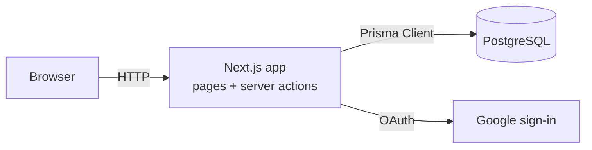

# Developer documentation: Group 53B capstone app

This folder is the team handbook for building, running and deploying our capstone EOI (Expression of Interest) and project-allocation web app.

If you're new, read the guides **in order**. Each one assumes you've done the one before it.

| # | Guide | Read it when… |
|---|---|---|
| 1 | [Local setup](01-local-setup.md) | You have a fresh laptop and want the app running, plus our day-to-day Git workflow |
| 2 | [Database & Prisma](02-database-and-prisma.md) | You need to add or change a table/column, or understand how data flows |
| 3 | [Authentication](03-authentication.md) | You're touching sign-in, roles, or protecting a page |
| 4 | [Frontend development](04-frontend-development.md) | You're building a new page, form or feature |
| 5 | [AWS EC2 + Docker deployment](05-aws-ec2-docker-deployment.md) | You're setting up or looking after the live server |

---

## The app in one minute

- **What it does:**
  - Students browse published projects and submit EOIs.
  - Mentors and sponsors apply through an EOI form.
  - Conveners review EOIs, assign roles and place people in projects.
  - The public can view a showcase.
- **Where the code is:** everything runs from the **`my-capstone/`** folder inside the repo. The repo root holds this `docs/` folder, the team README, and design files in `Database_Information/`.
- **Tech stack:**

| Layer | Technology | Where |
|---|---|---|
| Framework | Next.js 16 (App Router), React 19, TypeScript | `my-capstone/src/app/` |
| Styling | Tailwind CSS v4 | `my-capstone/src/app/globals.css` + `className`s |
| Backend logic | Next.js **Server Actions** (no separate API server) | `my-capstone/src/actions/` |
| Validation | zod | `my-capstone/src/lib/validation/` |
| Database | PostgreSQL 16 (in Docker) | `my-capstone/docker-compose.yml` |
| ORM | Prisma 7 | `my-capstone/prisma/`, `my-capstone/src/lib/prisma.ts` |
| Auth | Auth.js (next-auth v5) + Google sign-in, database sessions | `my-capstone/src/lib/auth.ts`, `authz.ts`, `src/proxy.ts` |
| Package manager | npm | `my-capstone/package.json`, `package-lock.json` |
| Hosting | AWS EC2 + Docker Compose | `my-capstone/Dockerfile`, `docker-compose.prod.yml`, `.github/workflows/deploy.yml` |

---

## Command cheat-sheet

Run these from inside `my-capstone/`. They are all defined in `my-capstone/package.json`.

| Command | What it does |
|---|---|
| `npm ci` | Install exact dependency versions from the lockfile (also runs `prisma generate`) |
| `npm run db:up` | Start the local Postgres container |
| `npm run db:down` | Stop it (your data is kept) |
| `npm run db:migrate` | `prisma migrate dev`: create/apply migrations after a schema change |
| `npm run db:seed` | Add starter data (conveners from `SEED_CONVENER_EMAILS`, sample projects, a post) |
| `npm run db:reset` | ⚠️ Wipe the local database and re-apply all migrations |
| `npm run db:studio` | Open Prisma Studio (a spreadsheet-style view of the DB) |
| `npx prisma generate` | Regenerate the typed Prisma client after changing `schema.prisma` |
| `npm run dev` | Start the dev server at <http://localhost:3000> |
| `npm run lint` | ESLint |
| `npm run typecheck` | Generate route types and run the TypeScript checker |
| `npm run build` | Production build (also type-checks) |

---

## Glossary

| Term | Meaning |
|---|---|
| **EOI** | Expression of Interest: an application from a student (for one project) or a mentor/sponsor (to take part) |
| **Convener** | Staff role that reviews EOIs and assigns roles (`Role.CONVENER`) |
| **Server Component** | A React component that runs only on the server; it can query the DB directly. This is the default in `src/app` |
| **Client Component** | A component with `"use client"` at the top; it runs in the browser (forms, hooks) |
| **Server Action** | An `async` function in a `"use server"` file that forms can call directly, like a mini API endpoint |
| **Migration** | A SQL file in `prisma/migrations/` that moves the DB schema from one version to the next |
| **Proxy** | Next.js 16's new name for "middleware": `src/proxy.ts` runs before protected pages load |
| **PR** | Pull request: how every change gets reviewed and merged into `main` |

---

## Known issues to be aware of (as of this writing)

These were found while writing the docs and haven't been fixed yet. They're tracked here so nobody loses an afternoon to them.

1. **`npm run build`, `npm run typecheck` and `npm run lint` currently fail.** `src/app/(protected)/dashboard/page.tsx` uses `<SetRoleForm>` without importing it. The dev server still runs, but `/dashboard` crashes as soon as a user without a role exists. Lint also reports two unescaped `'` characters in `src/app/(public)/page.tsx`.
2. **Migrations were squashed** into a single `20260929064528_init` migration. If you set up the DB before that commit, run `npm run db:reset` once (see [02 → Troubleshooting](02-database-and-prisma.md#troubleshooting)).
3. The setup steps in the repo-root `README.md` copy `.env.example` before `cd my-capstone`. Follow [01-local-setup.md](01-local-setup.md) instead.
4. **Google sign-in on the live server needs a domain name with HTTPS.** See [05 → Domain, HTTPS and Google sign-in](05-aws-ec2-docker-deployment.md#11-optional-but-needed-for-google-sign-in-domain--https-with-caddy).
5. There are **no automated tests** yet, and no CI that runs lint/build on pull requests.
6. **Dark mode is hard to read.** When your OS is in dark mode, `src/app/globals.css` makes the page background dark, but cards stay white with light text.
